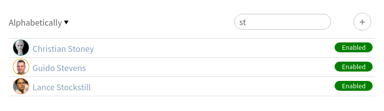
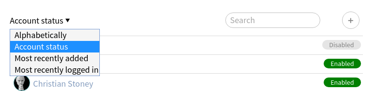
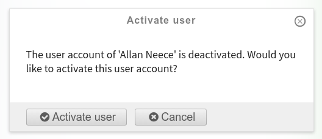

Administrator tool
==================

.. versionadded:: 1.2

The applications eases the life of the site administrators.

---------------
User management
---------------

A fully featured user listing view, providing a search and sorting options,
allows the administrator to have full control on its site users.

The users can be sorted:

- Alphabetically
- By their state
- By creation date
- By login date

Through this application it is possible to add a new user and control their state.

-----------
Screenshots
-----------

The app landing page
--------------------

    The app landing page

    It shows all the users sorted alphabetically and with the possibility to
    search for users.
    If you have lots of users do not worry!
    The users are paginated and will load automatically as you scroll the page.

The users sorted by their account status
----------------------------------------

    The users sorted by their account status

The activate/deactivate user confirmation panel
-----------------------------------------------

    The activate/deactivate user confirmation panel

    On each rowe of the user listing there is a badge showing the user status.
    By clicking on it you will be redirected to a panel asking you to confirm
    if you want to toggle the user state.

The create user panel
---------------------

    The create user panel

    By clicking the plus icon in the app landing page it is possible to add a new user.
    The user will receive an email
    (be sure your mail setting in the Plone control panel are ok)
    with a link to reset his password.
