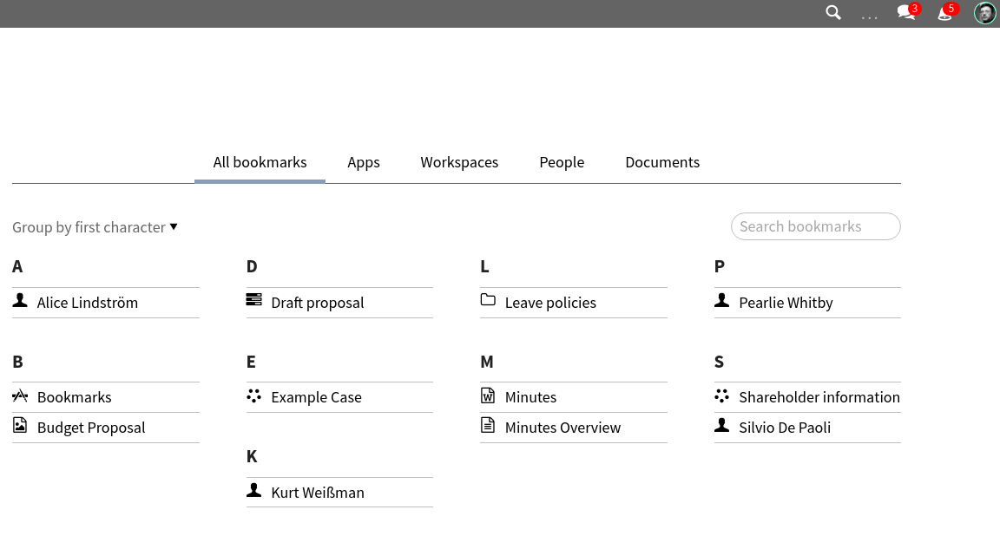
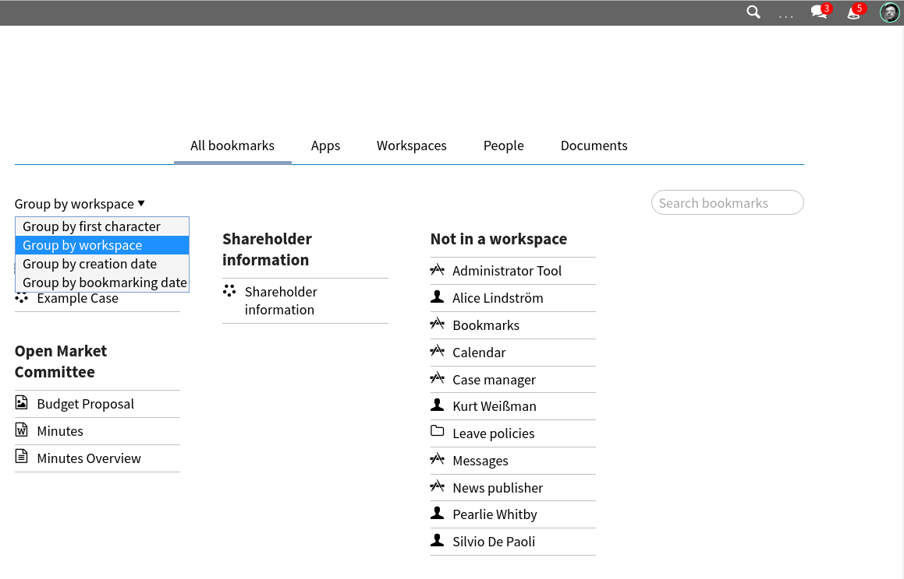
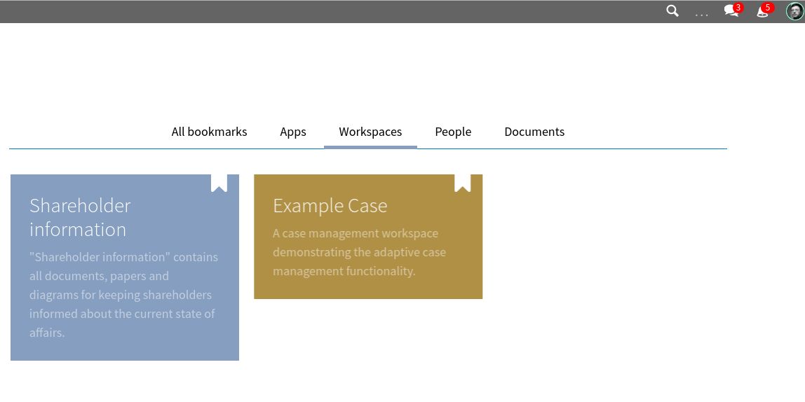
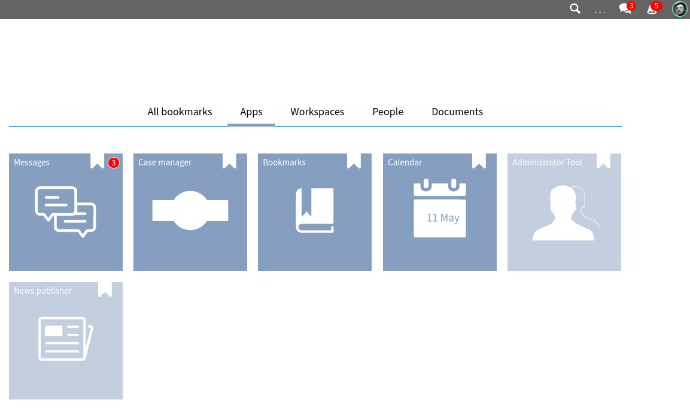
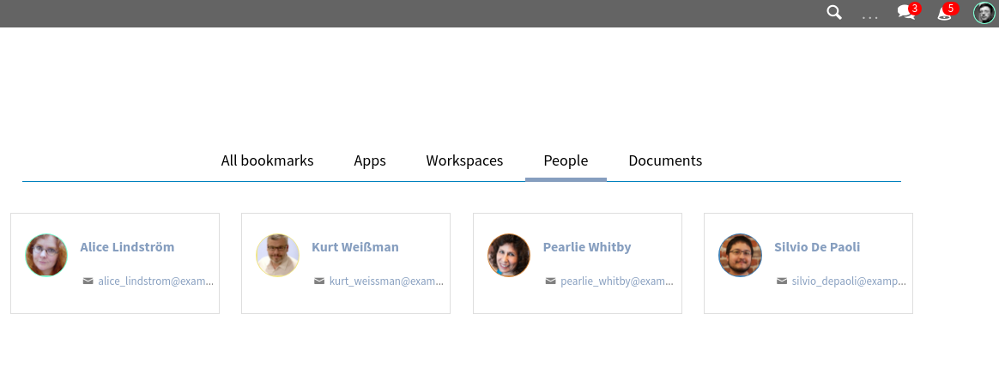
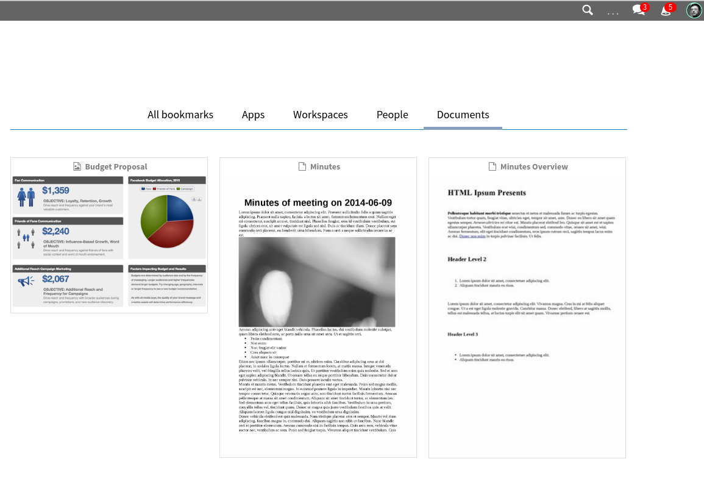
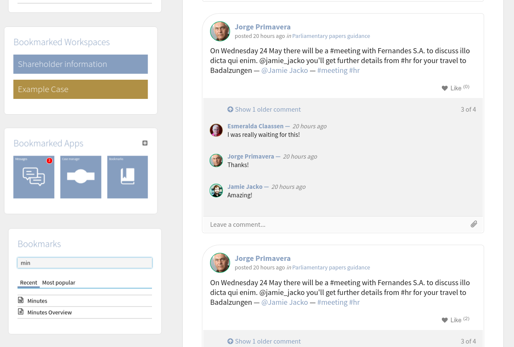

Bookmarks
=========

.. versionadded:: 1.2

The bookmark app takes care of providing the best way to find the documents you care about.

The app provides you convenient groupings for your bookmarks:

- by first letter (the default one)
- by workspace
- by document creation date
- by bookmarking date

Your bookmarking experience is enhanced by the tabs that provide
alternatives views that focus on subsets of documents.

We currently have the following:

- All bookmarks (the default one)
- Apps
- Workspaces
- People
- Documents

Convenients tiles are provided for your dashboard.
You can have bookmark tiles:

- For all your bookmarked documents (the tile provides a search filter and a most popular bookmarks tab)
- For all your bookmarked workspaces
- For all your bookmarked apps

-----------
Screenshots
-----------

The app landing page
--------------------

    The app landing page

    It shows all the bookmarks sorted alphabetically
    and grouped first letter

The bookmarks grouped by workspace
----------------------------------

    The bookmarks grouped by workspace

    It shows all the bookmarks grouped by workspace

The Workspaces alternative view
-------------------------------

    The Workspaces alternative view

    It shows all your bookmarked workspaces

The Apps alternative view
-------------------------

    The Apps alternative view

    It shows all your bookmarked apps

The People alternative view
---------------------------

    The People alternative view

    It shows all your bookmarked people

The Documents alternative view
------------------------------

    The Documents alternative view

    It shows all your bookmarked docuents

The available bookmark tiles
----------------------------

    The available bookmark tiles

    They are an amazing shortcut to your favourite content.
