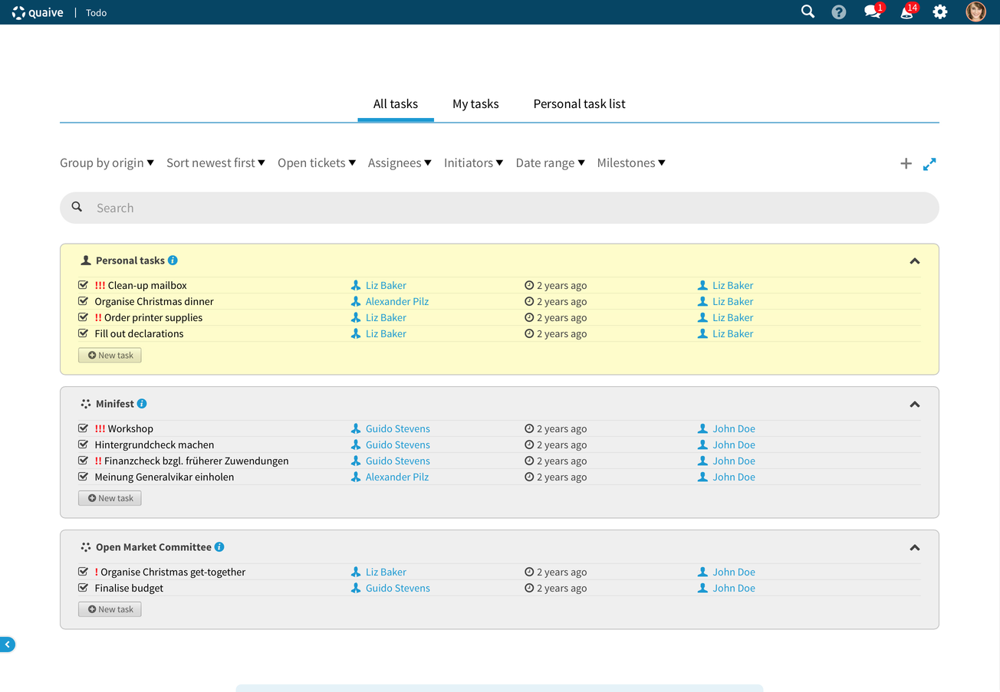
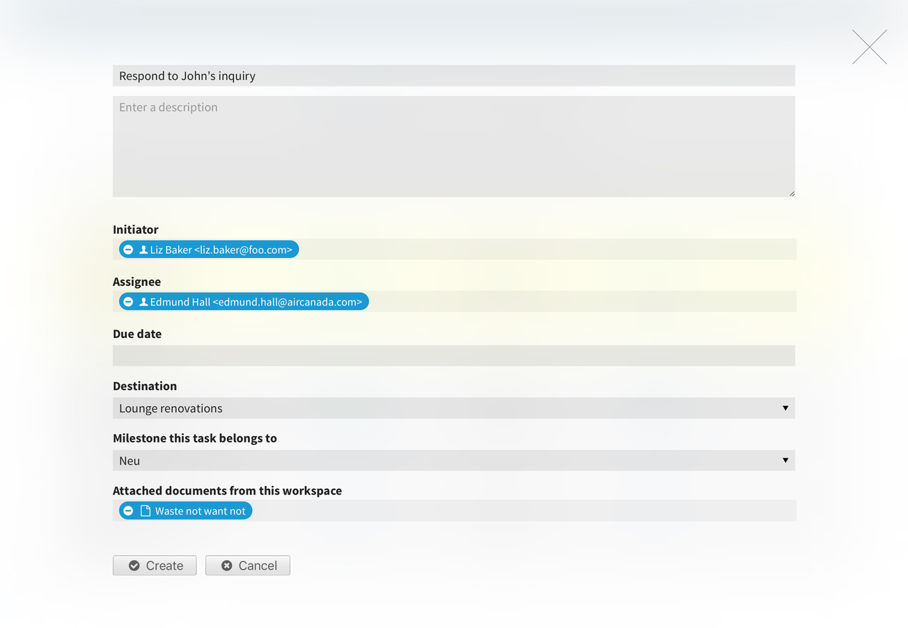
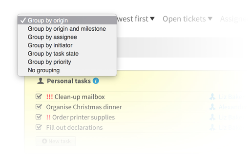
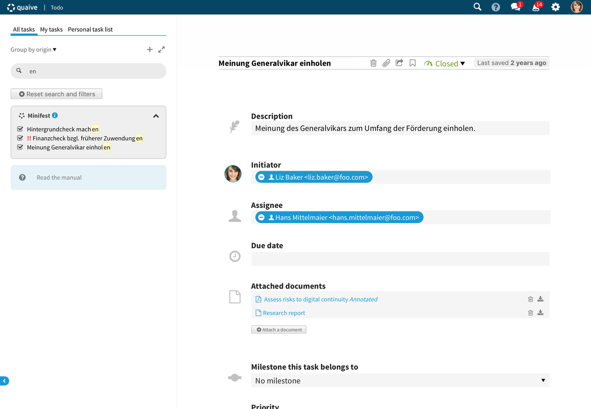

Todo
====

.. versionadded:: 1.2

The todo app that allows you to
find, create and handle all of your tasks or todo items
from a central location.

---------------------------
Sections of the application
---------------------------

The application always starts with a list of tasks.
Once you click on a task to view or edit it,
the task list will reduce to a sidebar and the task is shown on the right.
The task list can always be restored to its full view again,
by clicking on the arrows in the sidebar.

The todo comprises of three main parts:

1. All tasks
2. My tasks
3. Personal task list

All tasks
---------

In the all tasks section you may find any task that you created, that is assigned to you or that you have view and/or editing rights on.

My tasks
--------

My tasks aggregates only tasks that are assigned to you. Either by yourself, or by others.

Personal task list
------------------

The personal task list show tickets that are created through the Todo app, which do not live in a Workspace.

------------
Create tasks
------------

You can created taks by clicking on the button marked with a plus.
On the screen that follows,
you can enter details about the task,
including a title for the task,
a longer description about the task,
the assignee and the due date.

It's also noteworthy that you can select the destination of the task.
By default, tasks end up on your personal task list.
But you can also select a workspace in which the task will be created.

---------------------
Groupings and filters
---------------------

You may choose a certain grouping for your tasks that fits your way of working best.
If you're monitoring a programme of different projects,
it might convenient to group by origin (default).
Other grouping methods include:
by assignee, initiator, task state (open/closed), priority or no grouping at all.

Besides grouping,
it is also possible to change the order in which the tasks are sorted
or reduce the items on the list by using any of the filters above the search bar.

Sorting and filters are hidden in the sidebar view and only available in the full list view.

----------
Find tasks
----------

All tasks on the entire intranet that you have view or edit rights on
can be found through the search feature.
Just type in a few letters of the title or description of the task
you are looking for and it will appear in the list underneath the search box.

Search, filters and groupings can be combined.

You may reset both the search results and the filters
by clicking on the button that reads “Reset search and filters”.
