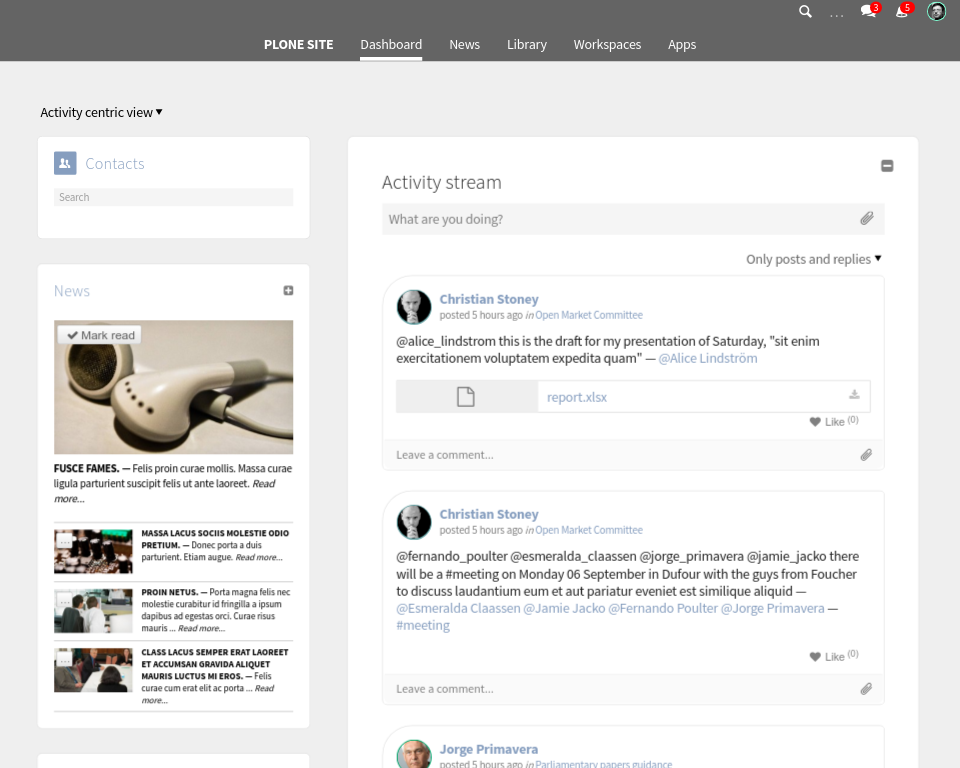
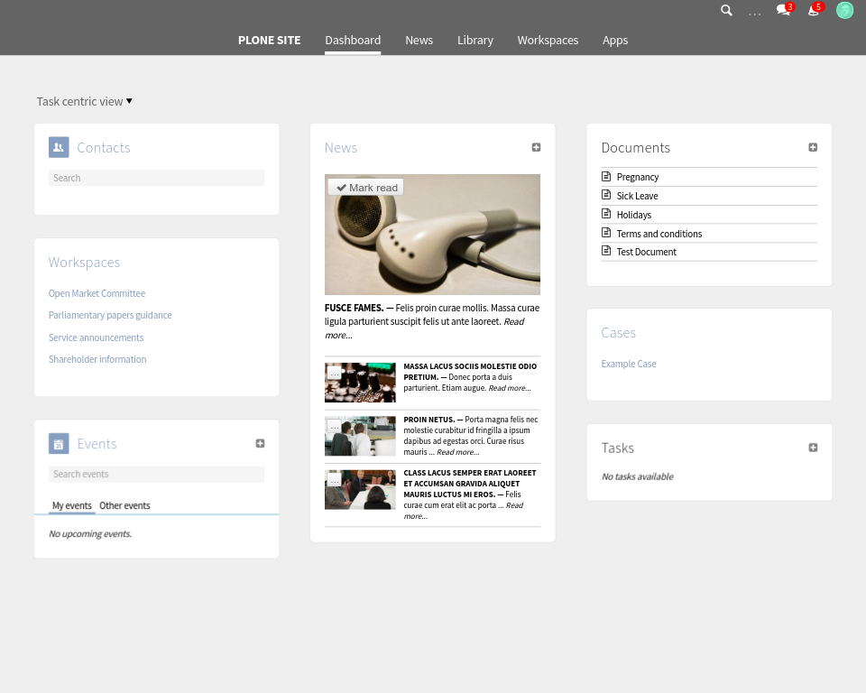
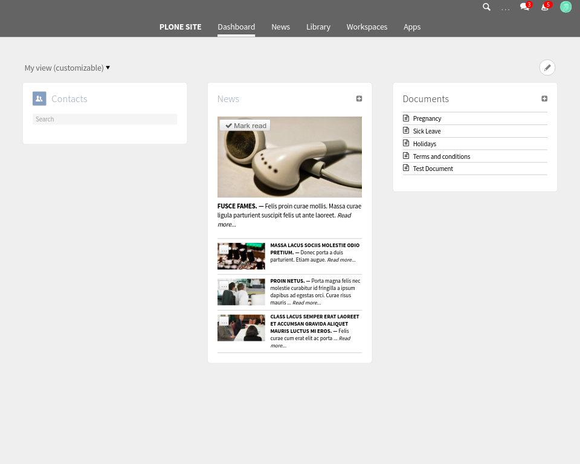
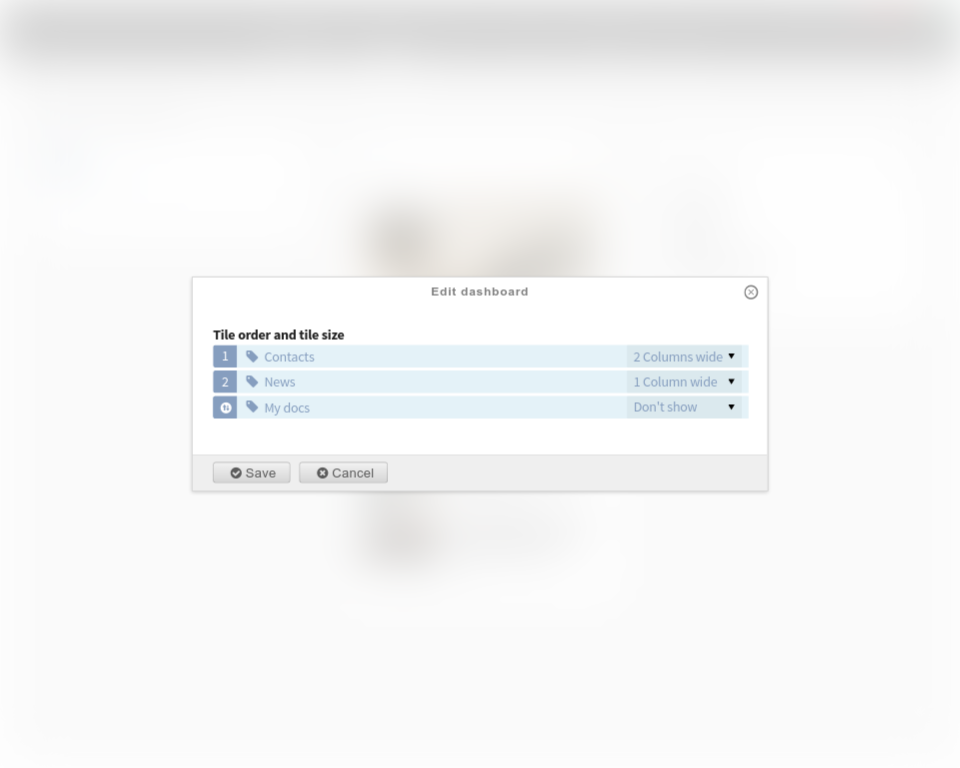

Dashboard
=========

.. versionadded:: 1.0

The dashboard is an overview of what is happening in Quaive.

Since Gaia (version 1.1) the dashboard can be customized sitewide.
Since Mars (version 1.2) the dashboard can be customized per user.

The user can select three types of dashboards:

- Activity centric
- Task centric
- My view (customizable)

Each dashboard is composed of elements, called tiles.

--------------------------
Activity centric dashboard
--------------------------

The activity centric dashboard is focused on the activity stream.

----------------------
Task centric dashboard
----------------------

The activity centric dashboard is focused on your tasks.

----------------------
Customizable dashboard
----------------------

.. versionadded:: 1.2

The customizable dashboard allows each user to boost the focus on what he cares more.

After clicking the top right pencil icon, the user can reorder, hide, shrink or exand the dashboard tiles.

