Library
=======
.. versionadded:: 1.0

The Library in Quaive is where content for all users of the intrant is stored. Unlike workspaces, which are usually restricted to a certain group of users, the Libray is available to all.

------------------------------
Viewing content in the Library
------------------------------

To access the Library, simply click the Library link in the main navigation area of your Quaive site. Contents in the library can be organised in hierarchies - that means folders and sub-folders.

In order to provide a good overview, the Library shows two levels of contents at the same time. When you open the library, you will see a view like this. For every main section, you see a little box with the section's title, and below the titles of the sub-sections.

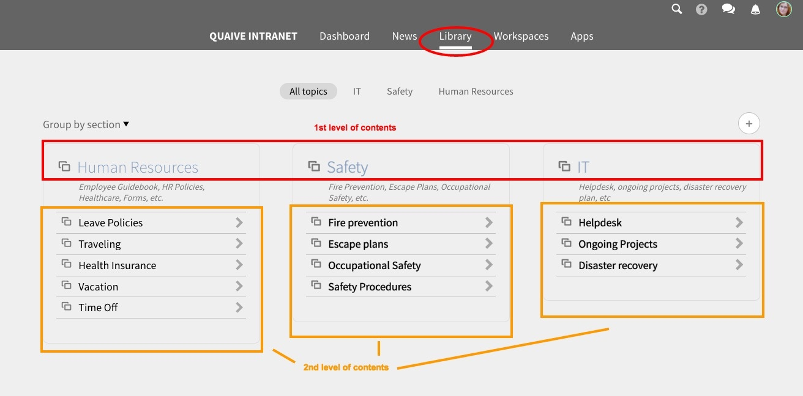

Grouped by section
------------------

By default, the contents inside the library are displayed by section and sub-section (i.e. folders and sub-folders). Clicking on one of the main sections shows you a little box for each sub-section. Inside the boxes, you have direct access to the documents they contain.

.. image::  images/library-section-overview.jpeg

If a document inside the Library is meant for download (such as a Word file, spreadsheet, etc), a click on a document will cause your browser to download it. If a document can be viewed in the browser, a click on it will open the detail view of it, for example:

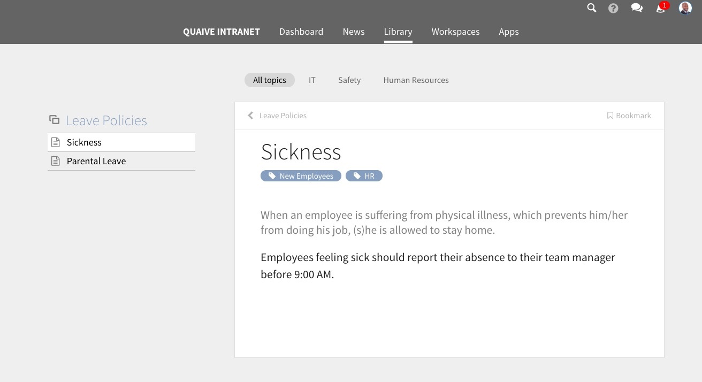

Grouped by tag
--------------

In Quaive, all contents can be tagged with keywords. This also applies to the Library. To view the Library contents grouped by the tags they were assigned, simply change the grouping in the little selector below the top navigation:

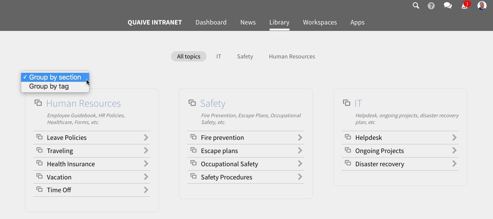

Similar to the display by section, you then see two levels, placed in little boxes. Each box shows the all documents that match your selected tag, under the heading of an additional tag that the document carries.

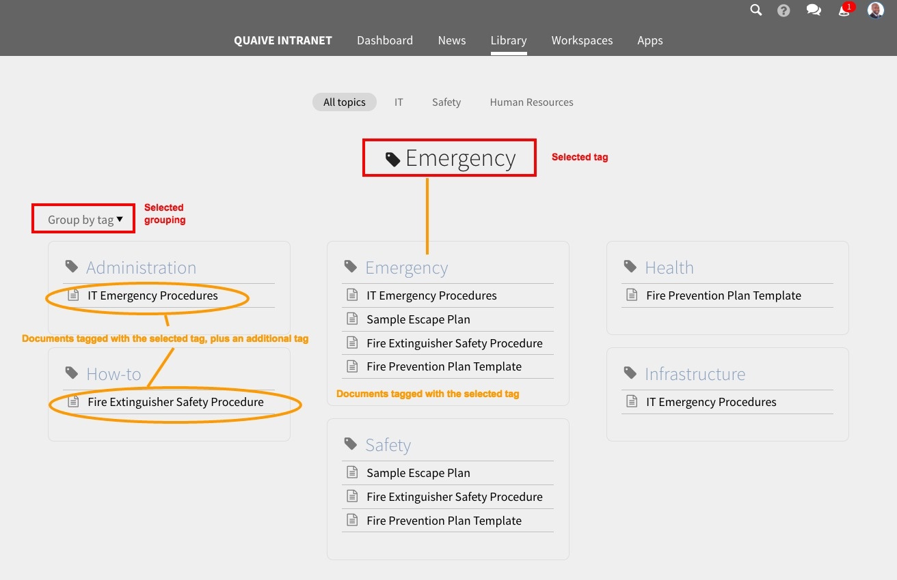

-----------------------------
Adding content to the Library
-----------------------------

For adding documents to the Library or editing existing ones, a special permission is required. Only authorised users can publish contents in the Library that will then be visible to all users. These users are called "Library publishers".

From within a workspace
-----------------------

Any user of a workspace can send a document from their workspace to the Library. This can make sense when the information of this document is considered relevant for all users of the intranet.

For security reasons, a document must first be published inside the workspace before it can be sent to the Library. This is to ensure that no contents that are not meant to be visible for all users get published accidentally.

On a published document, you have the option "Publish to Library" inside the menu of additional options:

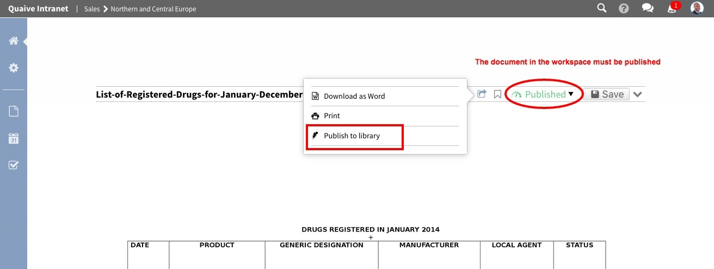

A click on it will open a little pop-up window where you can choose the destination:

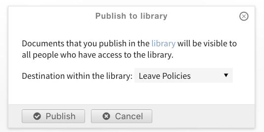

In the selection menue, pick the desired section of the Library:

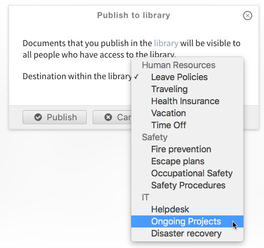

After a click on the "Publish" button, you see a notification on the document that a copy exists in the Library:

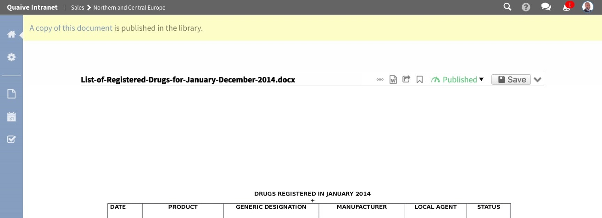

.. note::

  However, information pushed to the Library from a workspace is not automatically visible to all. A Library publisher still needs to make such a document publicly visible via the CMS (see :ref:`publish_in_cms` below).

From the CMS
------------

User who are Library publishers see a little "Plus" icon on the Library:

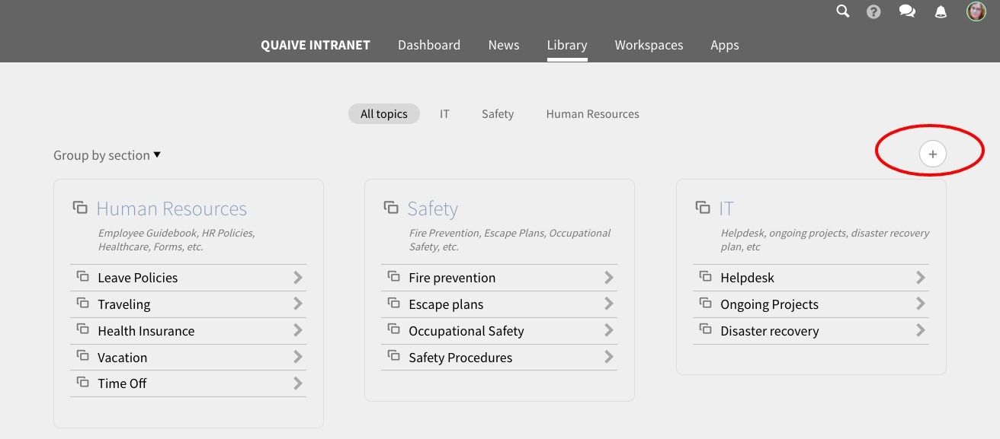

A click on it will open the Content Management System (CMS) view. Here, you can add new Library sections and folders (1st and 2nd level of the structure) as well as new documents:

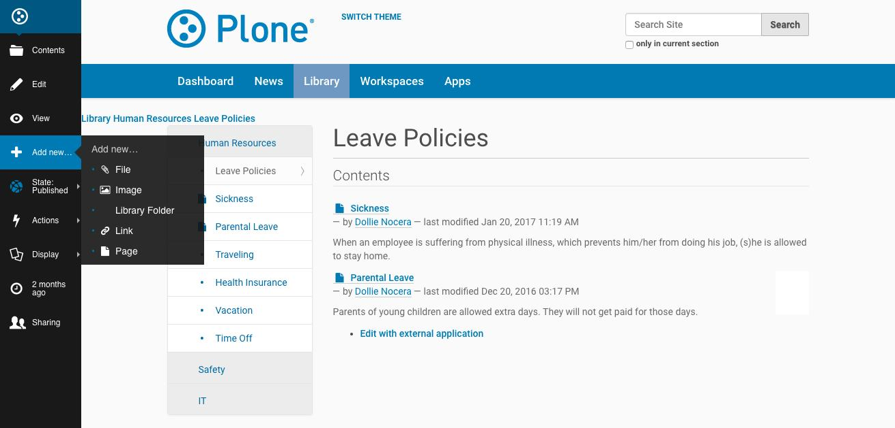

Once a new document has been created, you can continue to edit it via the "Edit" link in the sidebar on the left. You might want to add tags (under the tab "Categories") or adjust the title and description.

.. _publish_in_cms:

Publishing Library Content
++++++++++++++++++++++++++

Once you are satisfied and want to make the document available to all users, be sure to publish it:

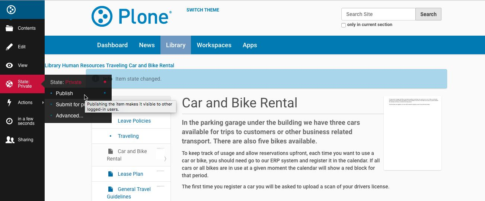

For futher reading about editing in the CMS, please refer to `The Plone documentation <http://docs.plone.org/>`_.
