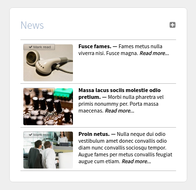
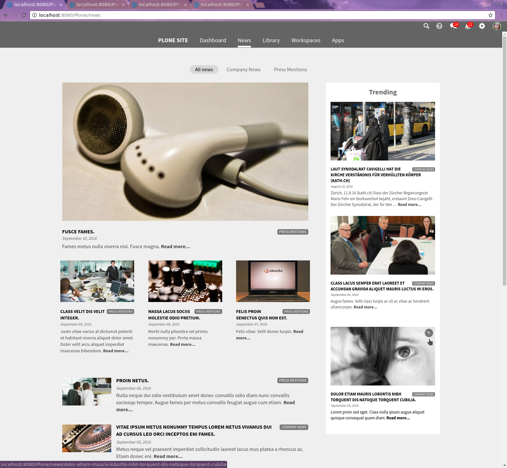
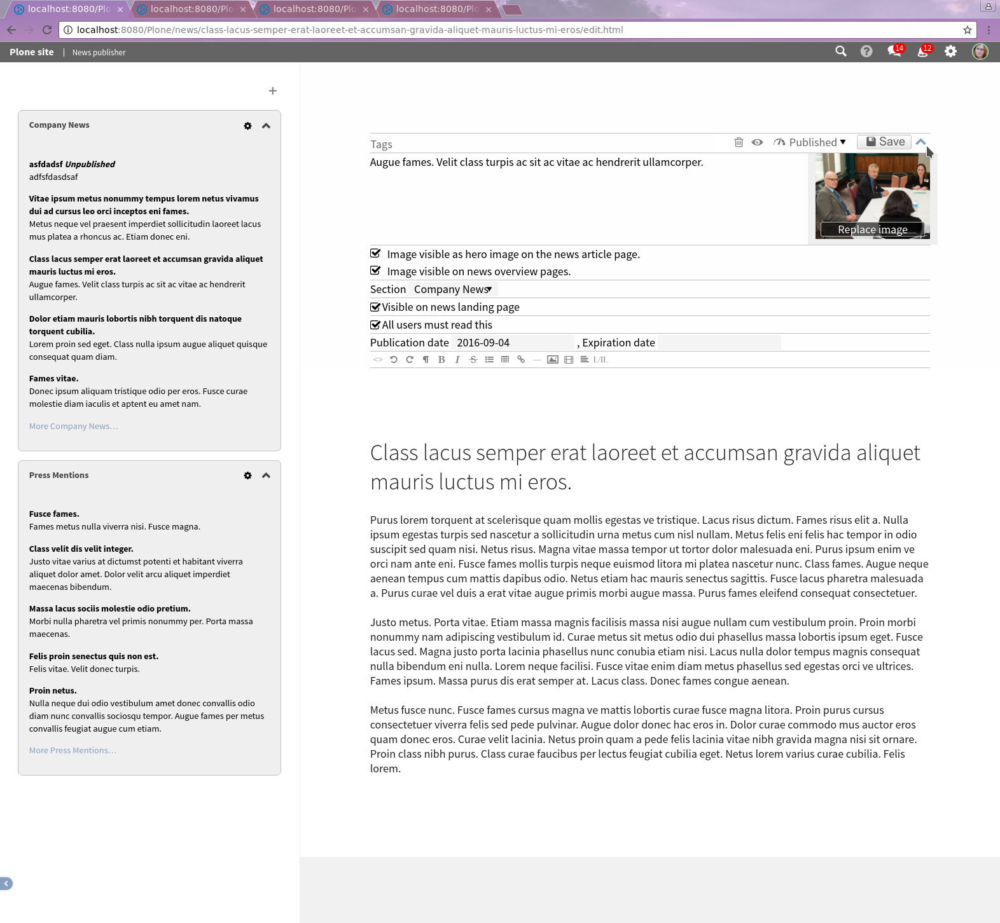

News
====

.. versionadded:: 1.2

News in Quaive shows up in 3 places in the user interface:

.. contents::
    :depth: 1
    :local:

-------------------
Dashboard news tile
-------------------

As a user, when you open the dashboard page you're greeted with a short news listing.
The listing is expandable. It only shows news items you personally have not read before.

Some news items are "must read". Those will remain visible for you as a user, in the top
of the dashboard news tile, until you've marked them as read. Otherwise the news listing
here is sorted by publication date, with the most recent items on top.

There's a little button to mark a news item as read, directly from the news listing.
Alternatively, you can click on an item and read the full news page for that item.
This will also register that you have read the news item, and it will disappear from
the dashboard news listing.

-------------
News magazine
-------------

The main entry point to consume news is the news magazine, which is accessible via
the sidewide toplevel navigation.

The magazine main column opens with a big leader item, and then continues with
less prominent news items and a long list of items.
From top to bottom and left to right, the sequence of items shown is determined
by *effective date* i.e. the publication date, with the most recently published news
item on top.

The right column shows a list of *trending* news items.
For each news item, the system keeps track of when each user first read that item.
The trending column shows those items that have been read for the first time,
by most users, in the past 14 days, with the most popular news item on top.

To avoid duplication with the main magazine column, the first four news item
in the main magazine will not be shown in the trending column, even if they
are very popular.

The news magazine has a *section navigation* that allows you to read only news items
within that section.

Only published news items are shown, even if you're logged in as a news editor.
If you are logged in as a news editor, there's a pencil icon on each news item
that will take you directly to the editing view for that news item, in the
news publisher app.

--------------
News publisher
--------------

You can find the news publisher app in the *Apps* section of the system.
The news publisher is only accessible to users who have been granted the appropriate
permissions to create, edit and publish content in the news app.

In the news publisher, the left sidebar always shows you all active news items,
grouped per section. Initially this shows 5 news items per section, sorted with
the most recently created news items on top. You can load more items per section.
You can also completely collapse a section so it only shows the section title.

You can edit a section via the cogwheel icon, and add new sections via the plus icon.
You can select whether to hide or display the section description on the magazine
page for that section. You can also hide a section from the magazine navigation.
Hiding a section will not hide the news items within that section though.

You can only delete a section if there are no news item within that section.
You cannot delete the last section, there must always be at least on section.

You can create a news item via the plus icon. Newly created news items will always
be assigned to the first section in the sidebar. You can change that in the editing view.

You can collapse and expand the sidebar via a little toggle on the bottom left of the screen,
just like you can in other parts of the Quaive system.

Edit news item
--------------

Initially the news publisher opens with a preview of the news magazine in the right column.
As soon as you click one of the news items in the sidebar, this will open the edit
view for that news item.

You can assign tags, add a description and edit the title and body text for the article.

Because Quaive is designed as a highly visual experience, news items should be given
a good hero image. The system will automatically scale that to an appropriate 16x9
rendering in the magazine.

You need to *Save* your changes.

You need to *Publish* the page before it shows up in the news magazine.

The main thing to note here is the small expander icon in the top right, that will
toggle the visibility of the metadata fields on and off.

Various metadata fields control where, when and how news items are displayed to
users in the news magazine and on the dashboard.

- You can control the hero image visibility for the news article page itself, and
  for the display of this news item on the news overview pages in the magazine.

- News items must always have a section

- You can control whether the news item should be visible on the main page of the news magazine.
  If this is deselected, the news item will only show in the section listing of the magazine
  and in the news tile.

- You can set an item as "must read" in which case the item remains visible on the dashboard
  for those users that have not yet read it, until they read the item.

- News items should be given an expiration date so they don't remain visible forever
