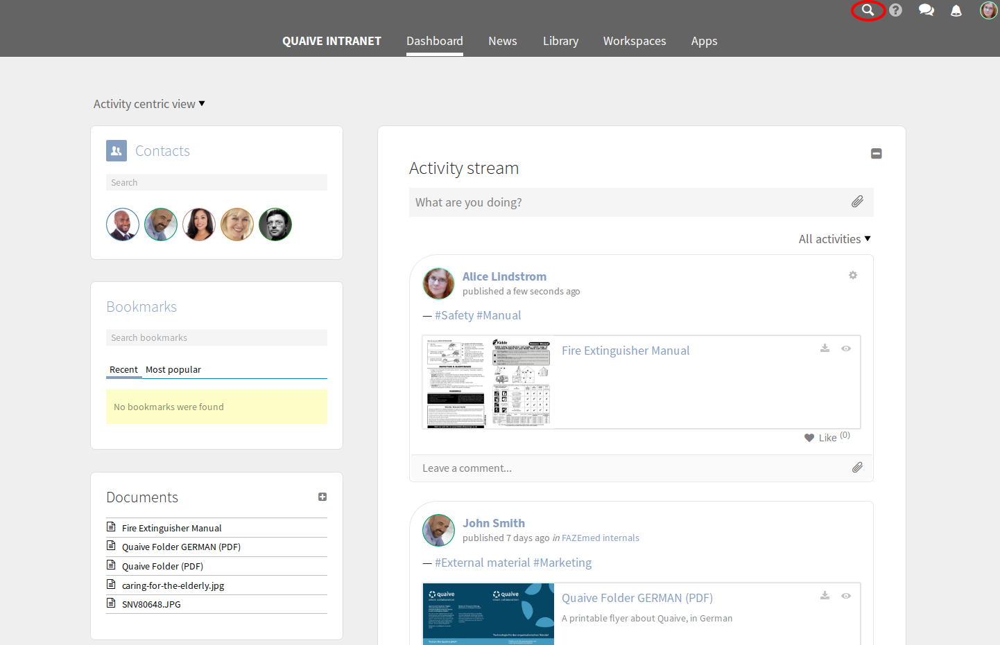
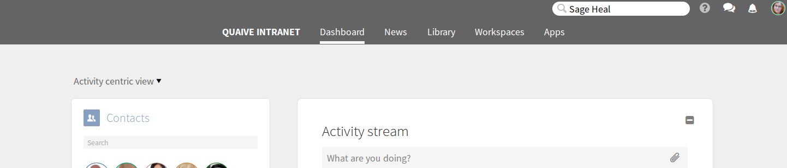
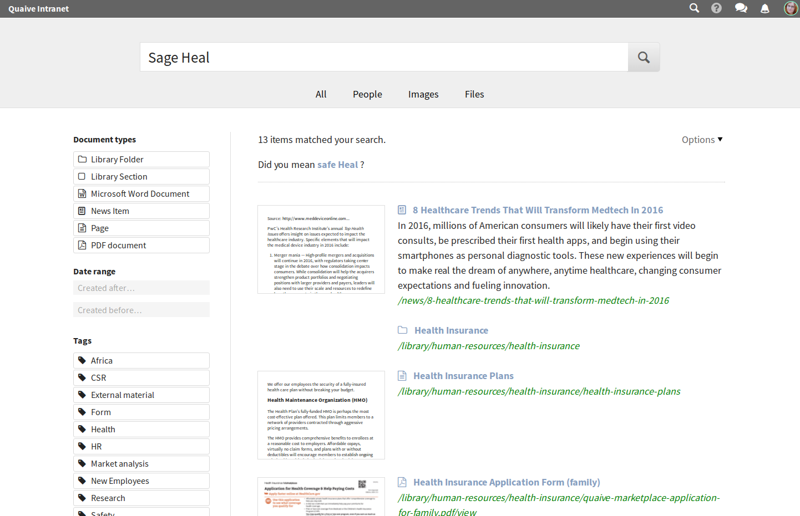
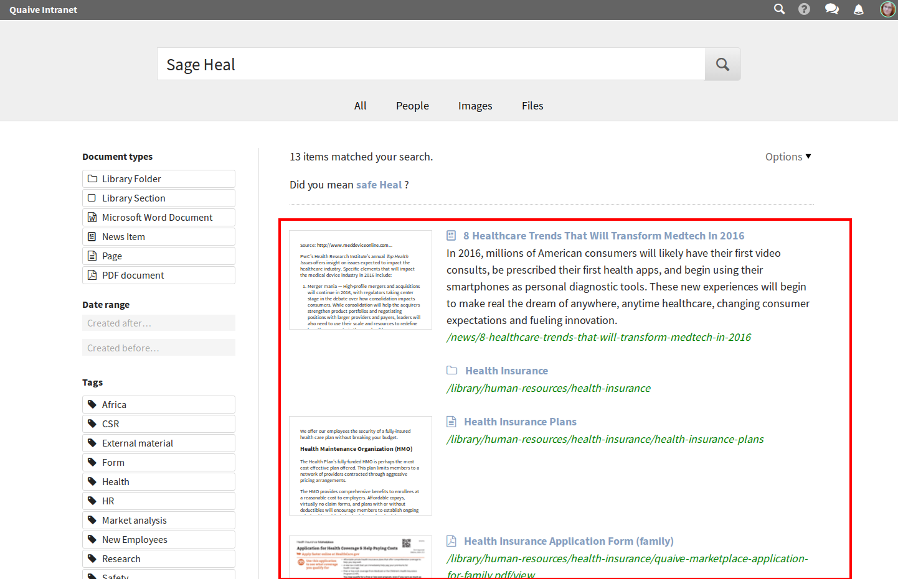
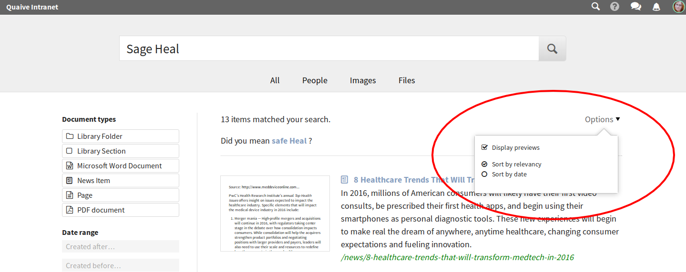
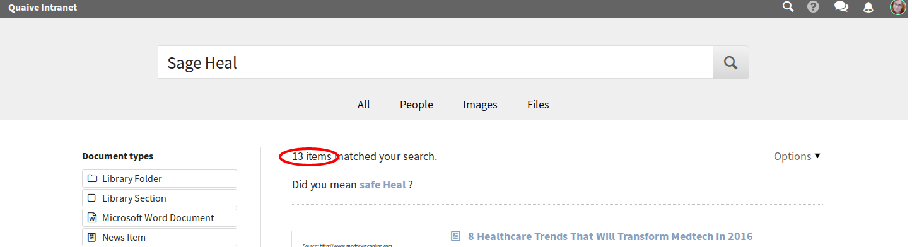
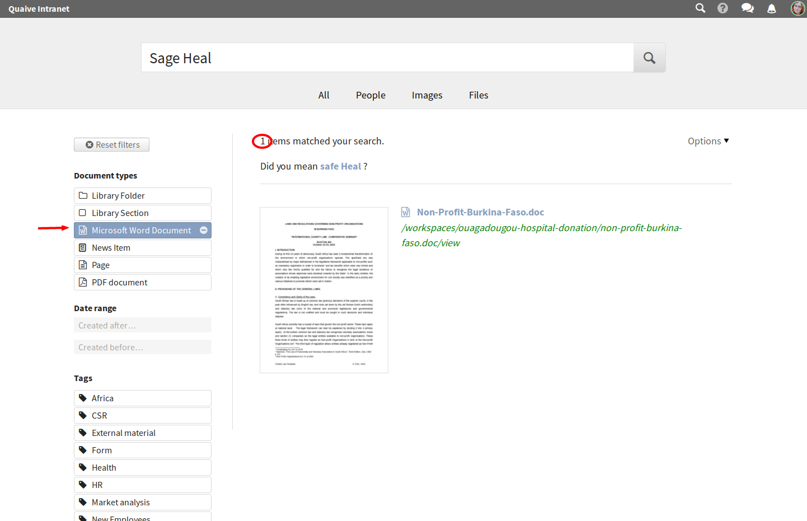
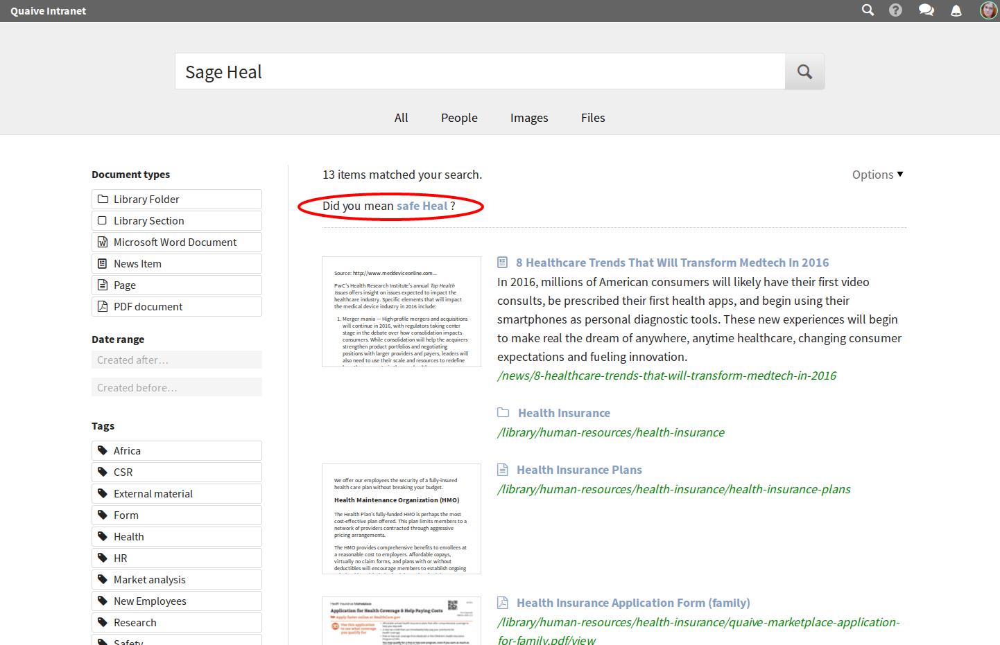
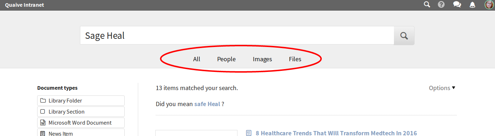

Search
======

.. versionadded:: 1.0

The search is the tool of choice if you know what you are looking for but not exactly where to find it.

---------------------
Using the search icon
---------------------

Among the icons in the top right corner you will find the search icon (a magnifying glass).

Click it and a text input opens. Enter one or more words that are contained in the document you are looking for.

Submit your input by pressing enter. You are taken to the search results page.

------------------
The search results
------------------

A list of results is displayed. The results most relevant to the search are shown at the top of the list. Results will have a preview and/or description where available.

There is an options menu that allows you to

* hide the previews to save some space on your screen
* change the sorting to have the most recent results at the top of the list.

Above the results list you can see how many results were found.

-------
Filters
-------

.. versionadded:: 1.1

If the list is long you can narrow down your search by selecting filters on the left. If, for example, you know the type of document you are looking for then you can select it from the offered document types. The result list is updated to reflect your selection.

--------------
Spell checking
--------------

.. versionadded:: 1.1

Even if there is a typo in your search you can still find what you are looking for. The search will suggest search words with similar spelling to those you entered.

----------------------
Alternate result views
----------------------

.. versionadded:: 1.1

Several specialized results pages help you search for specific things, for example people. They are accessible as tabs on the default results page.

