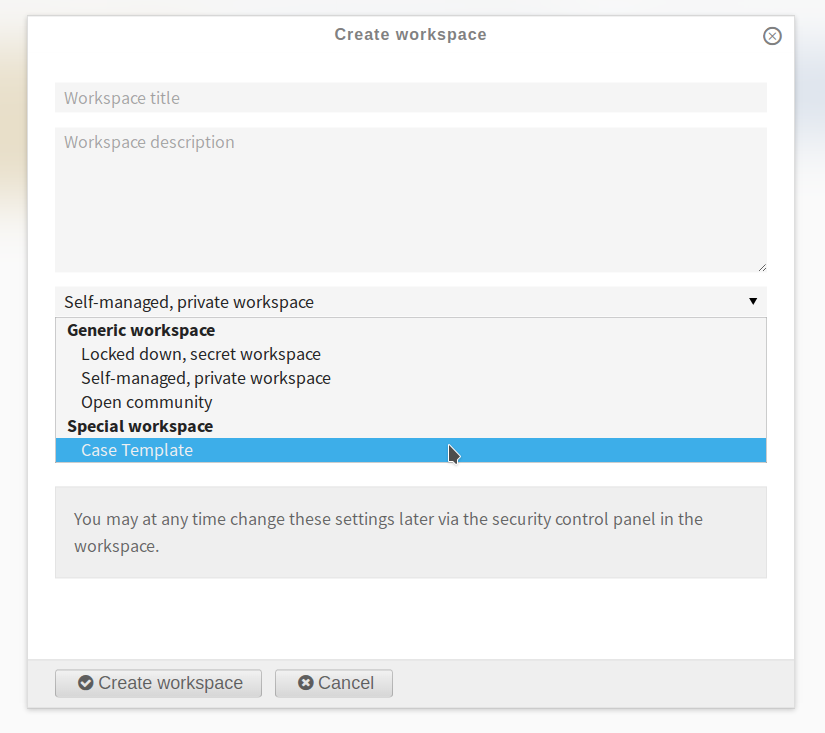
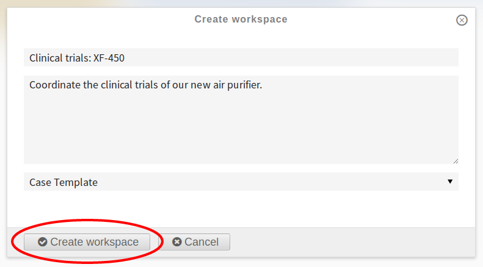
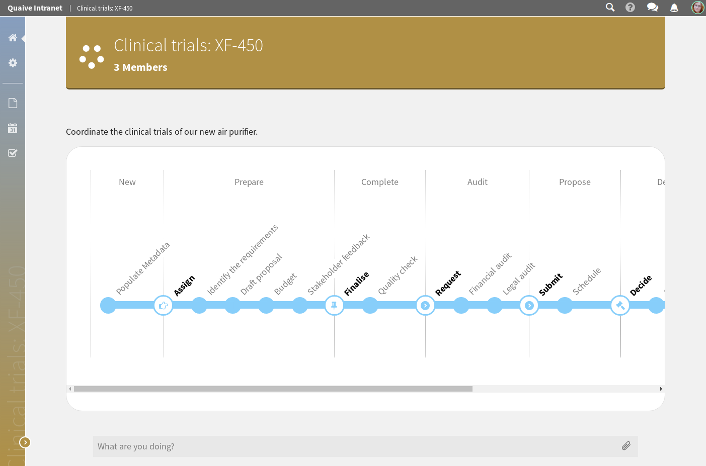
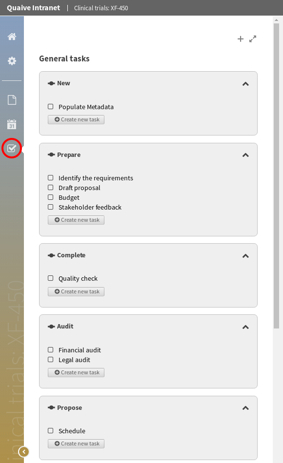
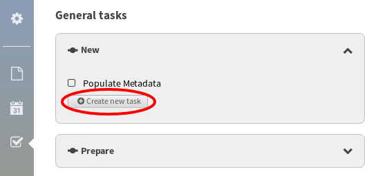
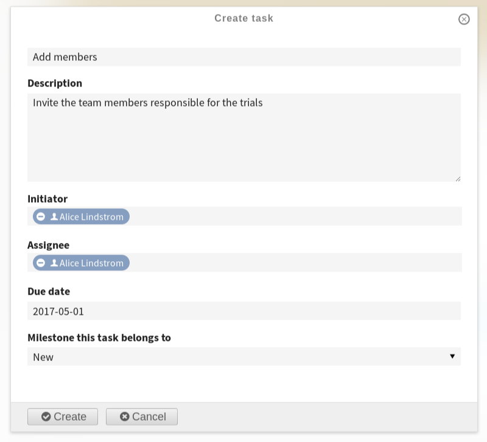
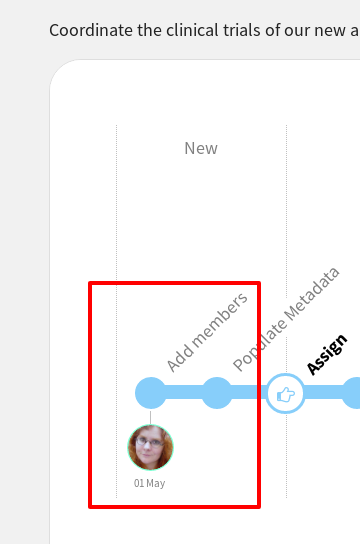

Case Workspaces
===============

Case workspaces are a special type of workspace which help teams to manage a shared work load with discreet milestones.
You can configure a case workspace with a set of tasks and milestones and then re-use that configuration for new projects.
You can also decide who is able to work on particular tasks during each milestone and notify workspace members when a particular milestone has been reached.

Let's step through the process of creating and using a case workspace.

.. image::  ../images/create-workspace-1.png

Select "Case Template" as the workspace type.

.. note::  Your Quaive site may have a selection of different pre-configured case workspaces available under the 'Special workspace' section.

Fill in the details and create the workspace.

On the case workspace you will see an overview of the tasks and milestones for this case workspace.

Please click on the tasks icon in the sidebar to configure additional tasks.

Let's create a new task to add members to the case workspace.
Please click the button to add a new task to the "New" milestone.

You can add an assignee and a due date.

You will also see the assignee and due date on the case workspace.

You can now add complete the task by adding a team member.
This works in exactly the same way as a normal workspace.

