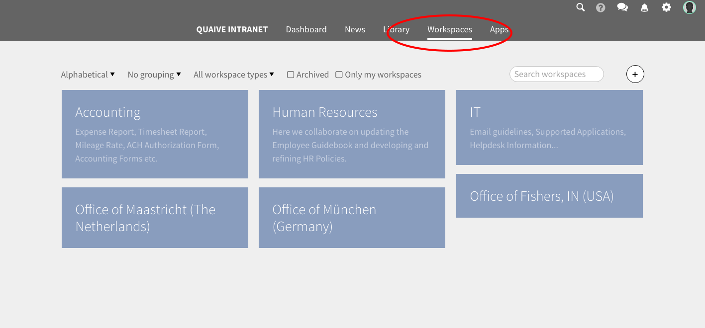

Workspaces
==========

Workspaces in Quaive are ...

To get an overview of all workspaces existing in a Quaive site you can use the navigation link in the main menu called "Workspaces".

This opens the workspaces overview page. Here all existing workspaces are displayed as tiles with their title and - if existing - description.
On this page you have several possibilities to display the workspaces you are looking for by filtering, grouping or a powerful search.

Read on to create your first workspace and discover all sections and content objects that make a workspace that powerful tool it is meant to be:

.. toctree::
   :maxdepth: 2

   workspace_overview
   workspace_settings/index
   workspace_content/index
   workspace_manage_content/index
   versioning
.. tagging
.. publishing
   workspace_events/index
   workspace_tasks/index

