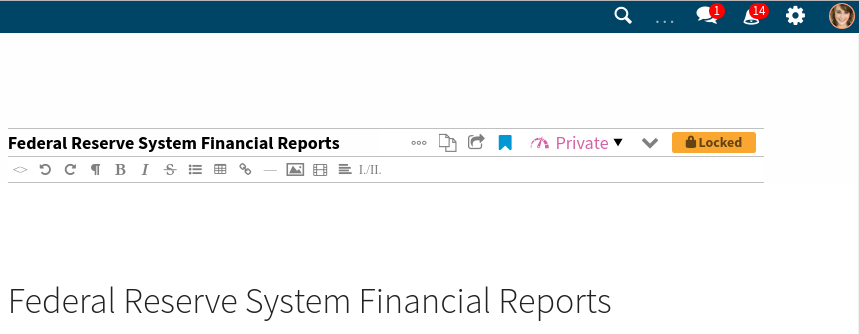
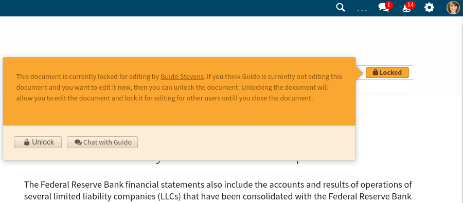

Locking
=======

Quaive provides locking support to prevent concurrent edits on the documents.

When the user starts to edit a document,
the document goes in to a locked state.

This is transparent for the user editing the document,
but other users that will visit the document will find a locked badge
instead of the normal save button.

Clicking on the locked badge will pop up a panel that
tells the user what is going on and offers some actions:

- the user can start a chat through the messaging app
  with the user who started editing the document
- the user can force the document unlock

