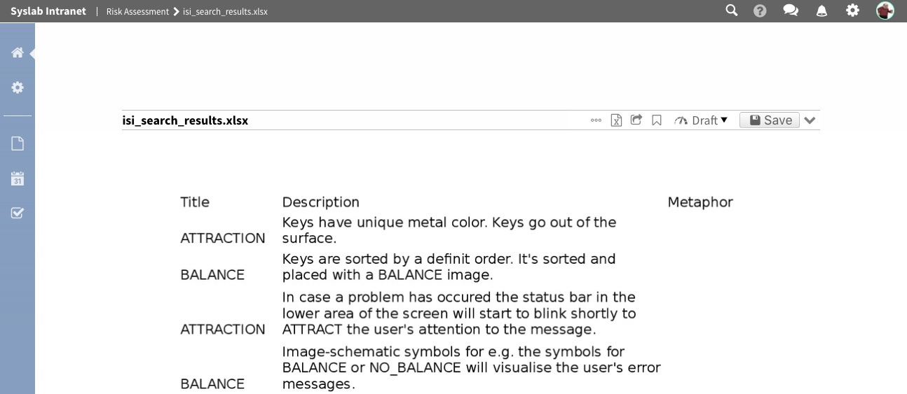
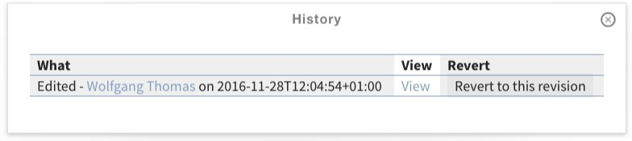
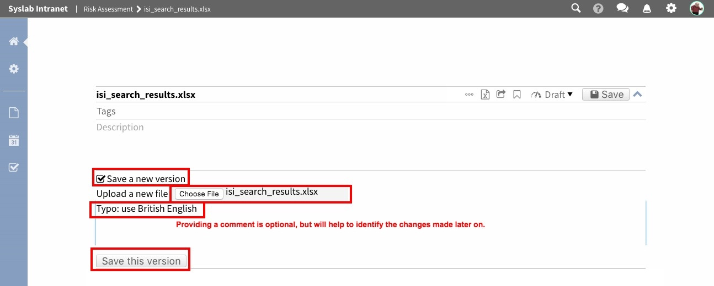
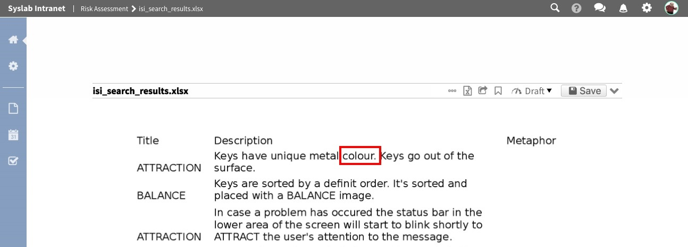
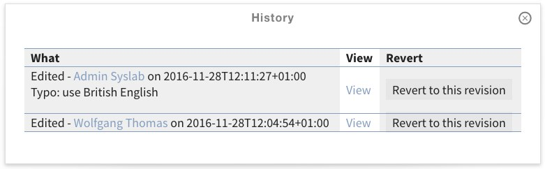
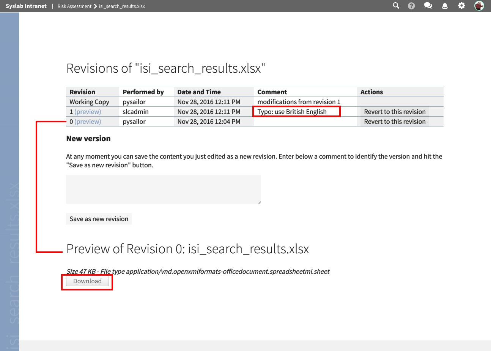

Versioning
==========

Versioning for uploaded files can be enabled optionally. Please contact your site's administrator for enabling it.

If versioning is enabled and you are uploading a new version of a file that already exists in Quiave, then the old version of the file is not simply replaced, but kept in the system. Although users will then see the new version of the file by default, they can still access previous versions of it.

The example below shows an Excel file that is present in a workspace. We can see the preview for this file:

If you click on the symbol with three dots, you can open the version history:

.. image:: images/versioning-open-history.jpg

It shows only one entry, for the initial action:

We have detected a typo in the Excel file. Therefore we want to upload a new version of it. In the edit form, we tick the checkbox "Save a new version", select the file to upload, and optionally provide a comment that explains the changes made. A click on the "Save" button uploads the file and creates a new version:

After a short while, the preview is re-generated, reflecting the updated state of the file:

If we look at the version history again, we can see a new entry about our change. We see *who* made the change, *when* the change was made and *what* the nature of the change was ("edited"). Also, we see the manually entered change note. By clicking on the "View" link next to a version, we can jump to the details page.

On the details page for a specific version, we see at the top again the list of all versions. At the lower part of the page, we see the details of the version we are currently viewing. Most importantly, we can use the "Download" button for downloading this version of the file.

In case a new version is not wanted, a click on "Revert to this revision", next to one of the older versions in the table above, will restore the selected older version.

