.. _workspace-content-label:

Create Content
========================

This part of the manual is about how to use and create content in an existing workspace.

The page icon opens the documents section. Here all content of a workspace is listed and managed.
There are several content types available to store and manage data in a workspace:

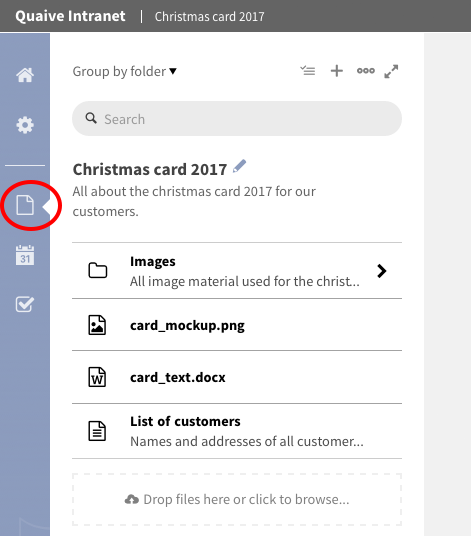

The main content types for workspaces currenty existing in Quaive are:

.. contents::
    :depth: 1
    :local:

In this section, the works as a file browser where the existing content of a workspace is presented in a list as you know it from the file browser on your computer.
There are several possibilities to group, filter or search for the elements in the sidebar to help you managing your content.

Learn more about using the sidebar for managing workspace content here: :ref:`workspace-manage-content-label`

-----------
Document
-----------

The document is the basic content type in Quaive. Documents are used to store text and have basic formatting possibilities to display it.

How to create a document
++++++++++++++++++++++++

To create a document a workspace, click the dots icon in the sidebar to open the more menue.

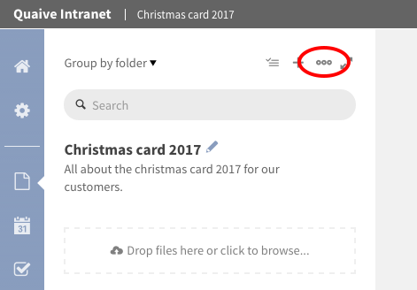

Select "Create document" from the list of actions.

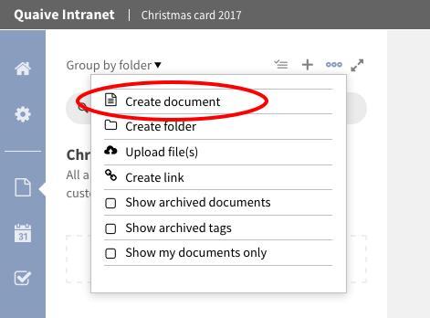

A form opens where you can choose the object type to be added. As "Rich text" is already selected, you do not have to change it.
Type in a title and if wanted a short description for your new document and click "Create".

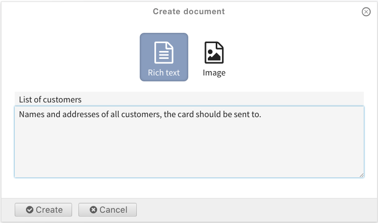

Your document is created and can be edited.

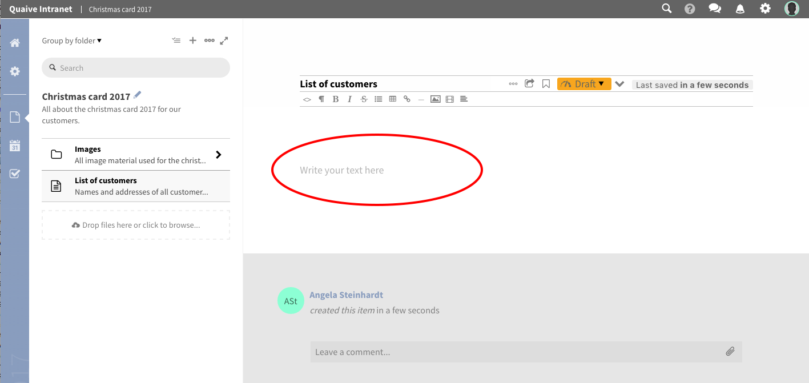

Type your text in the given text area of the open document. For formatting you can use the editor functions above the textarea which allow basic formatting as list elements, tables and also embedded images or links.

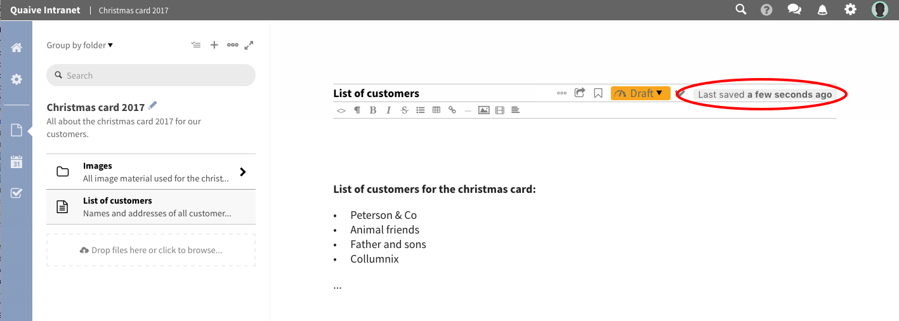

-----------
Folder
-----------

Folders in Quaive work much like they do on your computer. They can be used to structure and organize the content of your workspace.
A folder has a title and a description and can store all other types of workspace content.

How to create a folder
++++++++++++++++++++++

To add a new folder, click the dots icon in the sidebar to open the more menue.

Select "Create folder" from the list of actions.

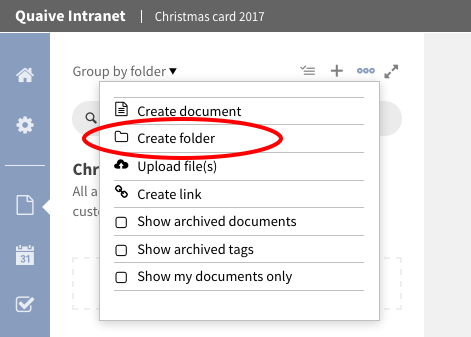

A form opens where you can type in title and a short description of your new folder.

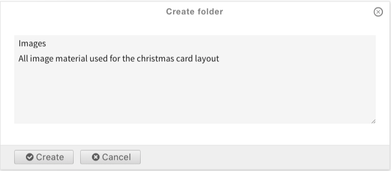

After clicking the button "Create" the folder is added to your workspace and immediately opens in the sidebar.
Now you can add content to your new folder.

You can change title and description of existing folders by clicking the pencil icon behind the title of the folder in the sidebar.
To get one level up back to the workspace's root folder click the link on the workspace title above the sidebar search field.

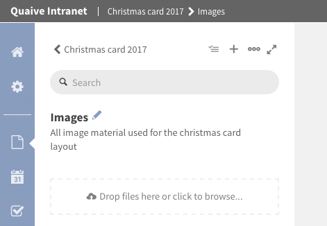

-----------
Image
-----------

An Image object in Quaive is used for uploading image files (JPG, GIF, PNG) so that you can insert them into Quaive documents or just have them stored in your workspace.

When uploading an image a preview is generated automatically to make it easy for you to find your images within the workspace.

How to upload an image
++++++++++++++++++++++++

Images can either be created as described in the section "How to create a document" or - as files - simply uploaded.
As the method to create an image object is almost the same as for documents we will take a closer look at the uploading method here.

When looking at the sidebar within a workspace or a folder in document section, you can find an upload area below the list of content.

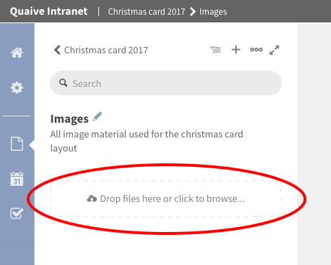

This area is used to upload an image (or also a file). To do this you have two possibilities:
You can either click the link within the drop area and select an image via the opening file browser

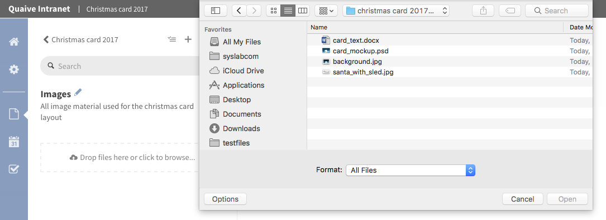

Or you can just add image(s) by dragging the image(s) you want to add from the file browser of your computer over the drop area

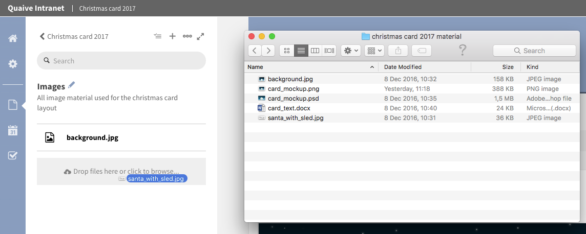

Both actions have the same effect, the image (or if more were selected images) is queued for upload below the upload area and you can watch the upload process of several objects easily.

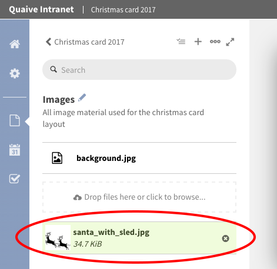

After the upload process has finished, the image occurs in the list of object in the sidebar.
To view the image, simply click on the list entry and the image is opened in the main content area.

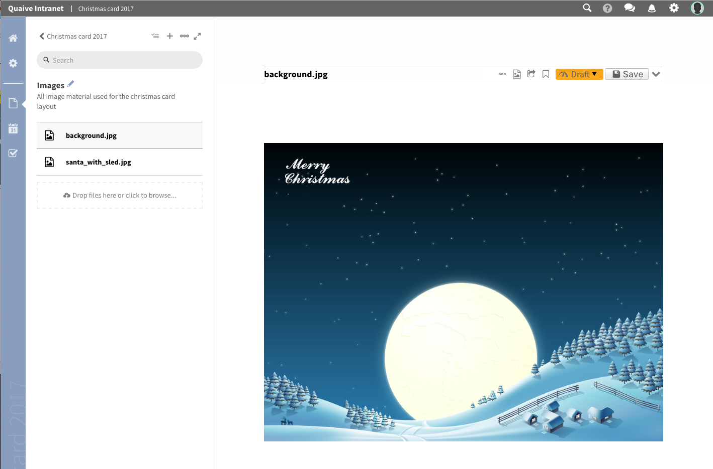

-----------
File
-----------

A File in Quaive is one of the most powerful objects as it can hold any kind of binary file you wish to upload with the intent to be downloaded by your site visitors. Common examples are PDFs, Word Documents, Excel tables and spreadsheets.
For the uploaded file a preview is generated automatically to give the user an idea of what the file is about.

There is also the possibility to have version management for files in Quaive. This is a powerful method to view and even restore older versions of a file and also get an overview over the versions in a table like version history view.

Read more about versioning here: [link to versioning.html]

How to upload a file
++++++++++++++++++++++++

Uploading files works exactly the same way as uploading images - so for a how to please read "How to upload an image_"

.. tbc: link

