.. _workspace-events-label:

Events
====================

This part of the manual is about how to use and create events in an existing workspace.

Quaive has a powerful built-in system for managing and showing calendar events.
Besides that, every workspace in Quaive can hold it's own event which makes it possible to keep users informed on important dates concerning their workspaces.

There is also a calendar App existing in Quaive which allows you to get an overview over all events in all workspaces that are relevant for you.
.. Learn more about the calendar App here:

To access the calendar of your workspace and see which events are scheduled please click the little calendar icon in the section navigation of your workspace.

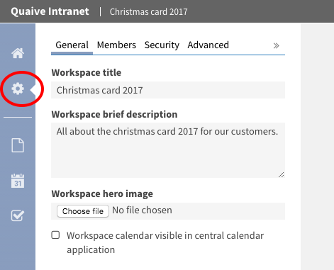

In this part of the manual you will

.. contents::
    :depth: 1
    :local:

-------------------------------
Create an event in a workspace
-------------------------------

To create an event in a workspace, click the plus icon in the sidebar.

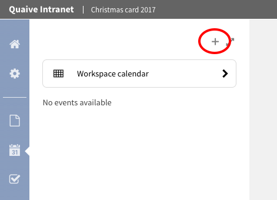

This opens the create event form.

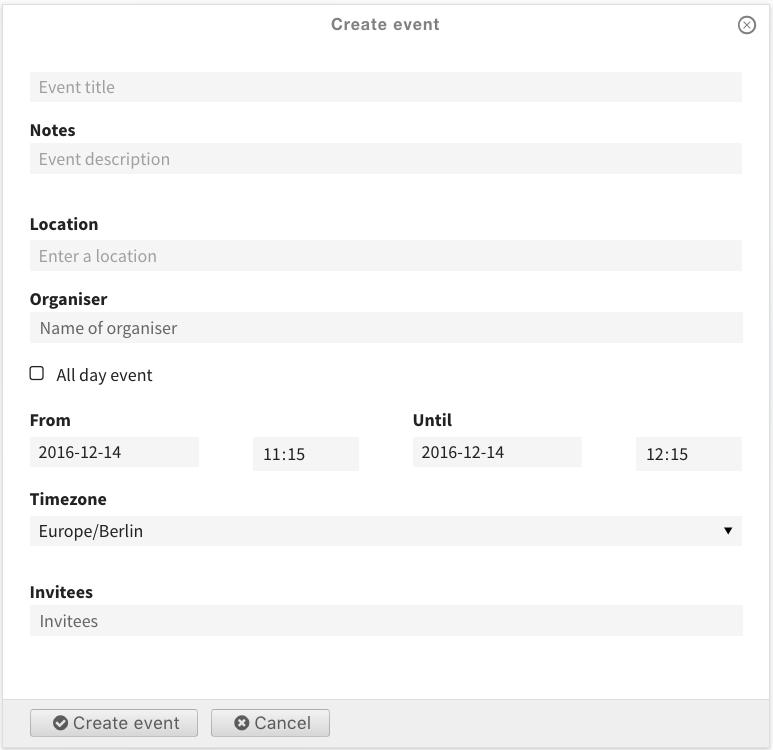

We will take a closer look to the fields on the create events form. From the top they are:

* **Event title** (*required*): The title is displayed in all places where the event is listed - calendar, portlets, listings, ...
* **Notes**: the description is also displayed in some overviews and should therefor be short
* **Location**: the location the event takes place (free text)
* **Organiser** (user picker field): the user organising the event
* **All day event**: when this is selected, the start and end time settings of the event are ignored
* **From** (*required*) (calendar field): the date and time the event starts
* **To** (*required*) (calendar field): the date and time the event ends
* **Timezone**: the timezone for the event's start and end times
* **Invitees** (user picker field): the users that are invited to the event

Only the title field and the start and end date and time are required. All other fields are optional and can also be left blank.

For date fields in Quaive a handy popup-calendar helps you selecting the date easily.

For the user related fields Quaive offers a special user picker that helps you browsing the user database to find portal users and assign them:

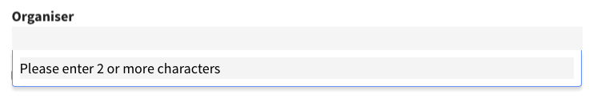

Just enter two or more chars to search for a user within the whole Quaive portal

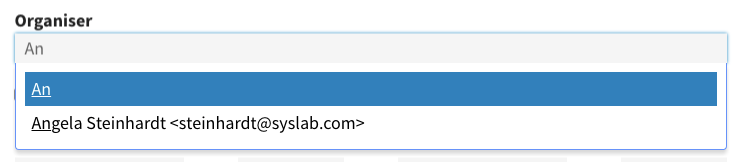

When selecting a user from the list of search results, the field is filled with the correct name and email address.

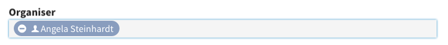

That's how the form looks for our test event. To create the event just click the button "Create" at the bottom of the form.

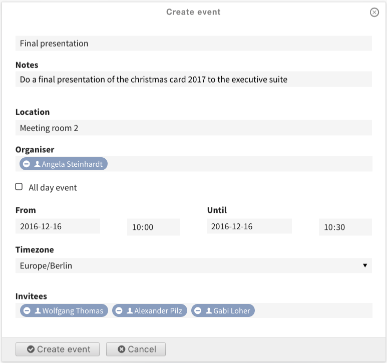

Your event is now created and listed in the sidebar under upcoming events.

There will be a section older events which holds events of this workspace with end dates in the past. You can see that in the next chapter of this manual when we take a closer look at the workspace's :ref:`calendar-view-label`.

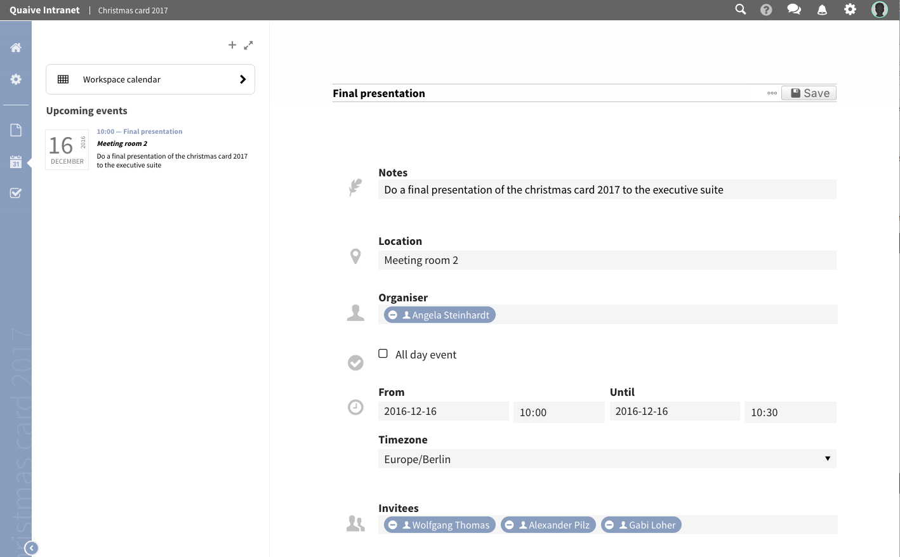

-------------------------------
Use the Calendar view
-------------------------------

Besides the list of events in the sidebar Quaive offers a calendar with several view options within the workspace to get a quick overview over all events scheduled for this workspace.

To open the calendar view please click the link "Workspace calendar" at the top of the sidebar.

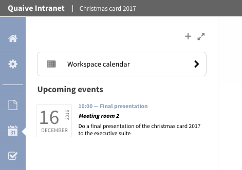

The calendar shows up with a month overview for the current month.
All upcoming events and events of the last few weeks are displayed with their start time, their title and the location they are supposed to take place in brackets.

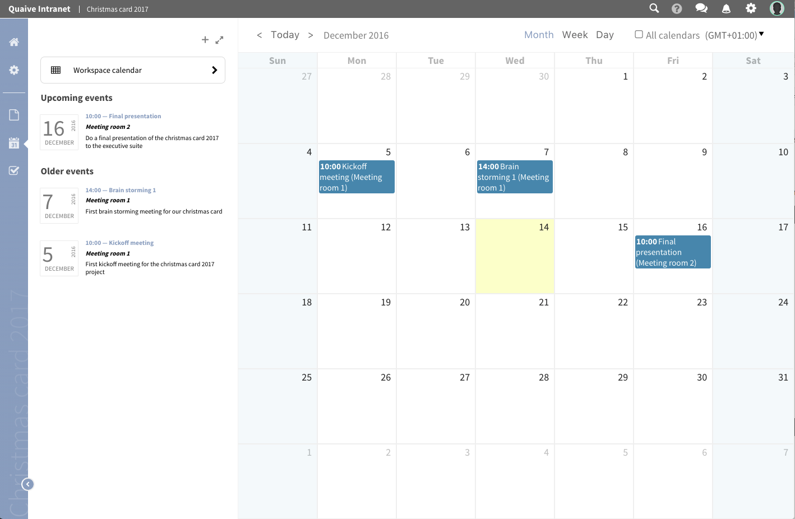

In each workspace you have also the possibility to display all events you are allowed to see that reside in other workspaces.
To show them up in your current workspace's calendar view just tick the checkbox "All calendars" above the calendar grid.

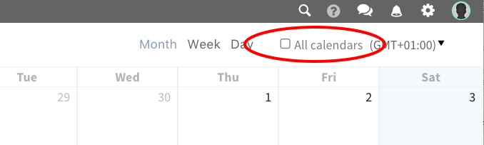

This displays all events for the visible period of time.
Events that do not belong to the workspace you are currently in are displayed in a transparent way to make it easy for you to see which events are from other workspaces.

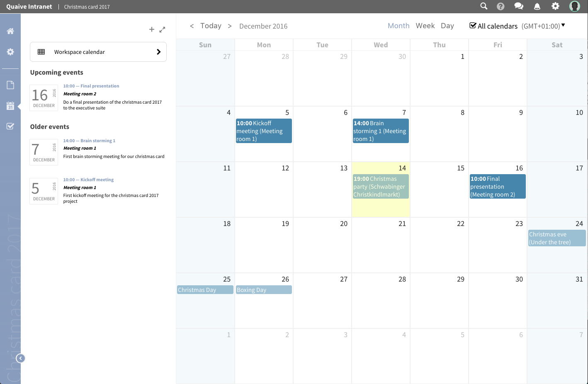

In the Quaive workspace calendar view - same as in the Quaive calendar app - you can switch between the calendar month, week or day view.

.. image::  ../images/events-calendar-6.png

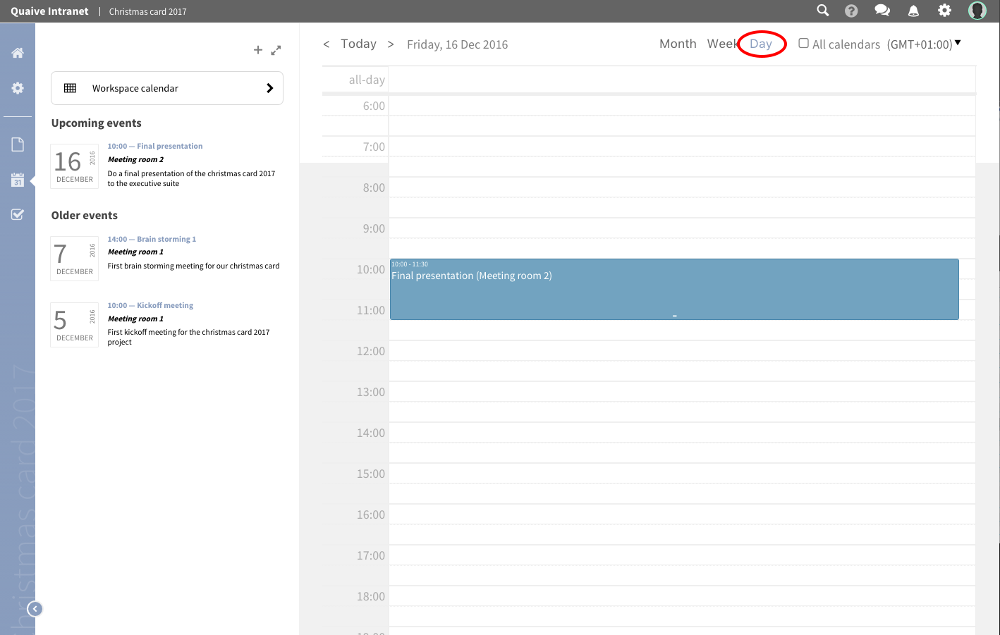

In all calendar views you can also create new events by simply clicking the tile for this day or time period.
This will open a compact popup form to create your events in a quick and easy way.

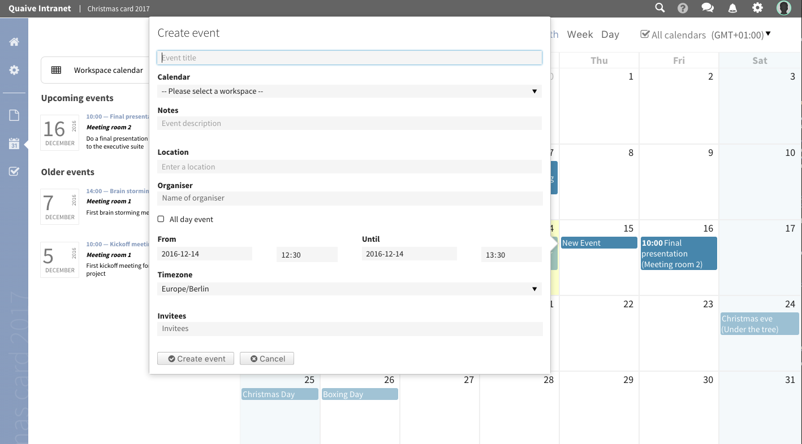

