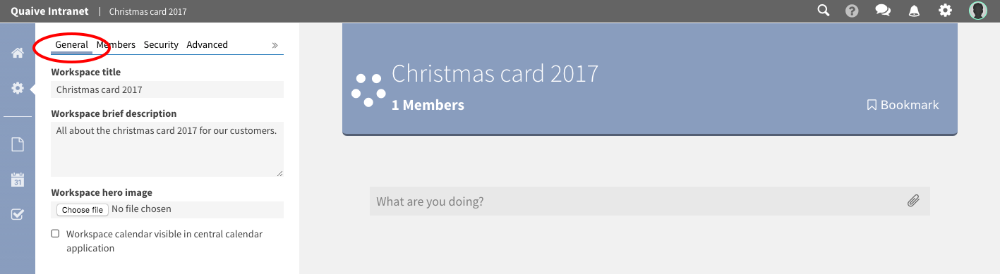

Workspace Overview
===================

.. _social-stream: ../social_stream.html
.. _workspace-settings: workspace_settings/index.html
.. _workspace-content: workspace_content/index.html
.. _workspace-events: events.html
.. _workspace-tasks: tasks.html

When entering a workspace you can see a set of icons in the coloured vertical bar on the left of the page.
They represent the different sections of the workspace and clicking them opens the sidebar, a vertical panel for the selected section.

.. image::  images/workspace-sections.png

The different sections of a workspace are listed here. Click one of the links to get more information about a specific workspace sections:

.. contents::
    :depth: 1
    :local:

-------------------
Home
-------------------

The first icon - the house icon - represents the home view of a workspace.
When clicking on it the sidebar is closed and the main view of the workspace with the social stream is displayed.

Learn more about using the social stream here: :ref:`social-stream`.

test link social-stream_

.. image::  images/workspace-home.png

-------------------
Settings
-------------------

The gearwheel icon opens the settings section. Here all metadata of a workspace is stored and managed.
Also the members of a workspace and the workspaces security settings can be edited in this area.

Learn more about managing the workspace settings here: :ref:'workspace-settings'

-------------------
Documents
-------------------

In the documents section all content stored in a workspace is managed.

Learn more about handling workspace content here: :ref:'workspace-content'

.. image::  images/workspace-documents.png

-------------------
Events
-------------------
tbc

-------------------
Tasks
-------------------
tbc

-----------------------------------
Hands on: How to create a workspace
-----------------------------------