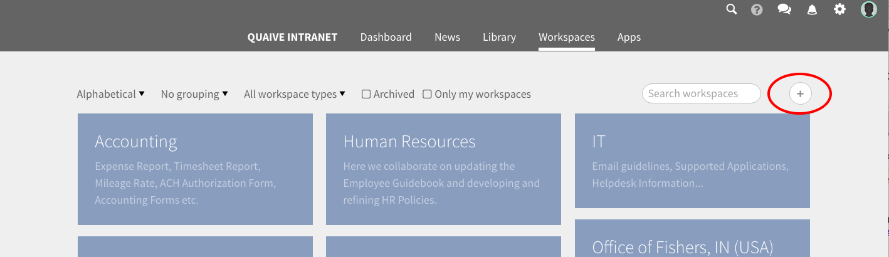
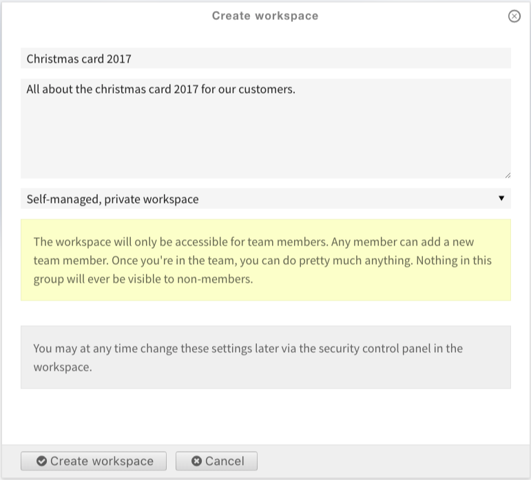
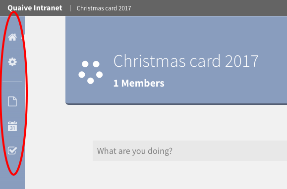
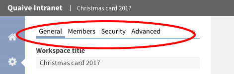
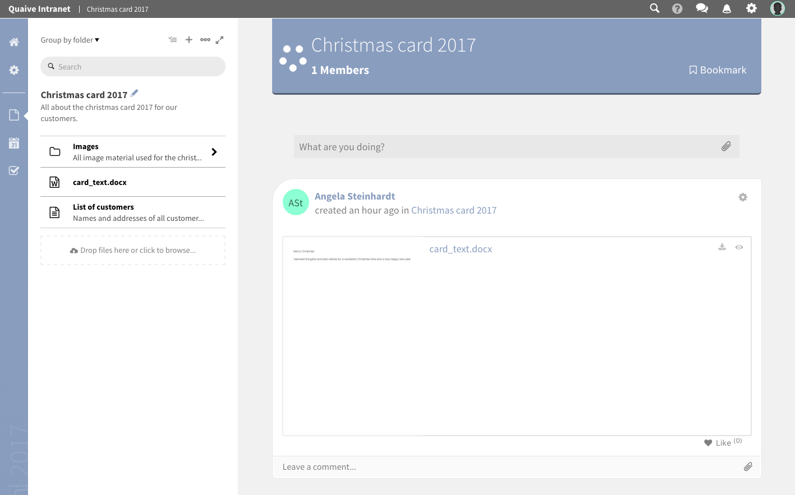
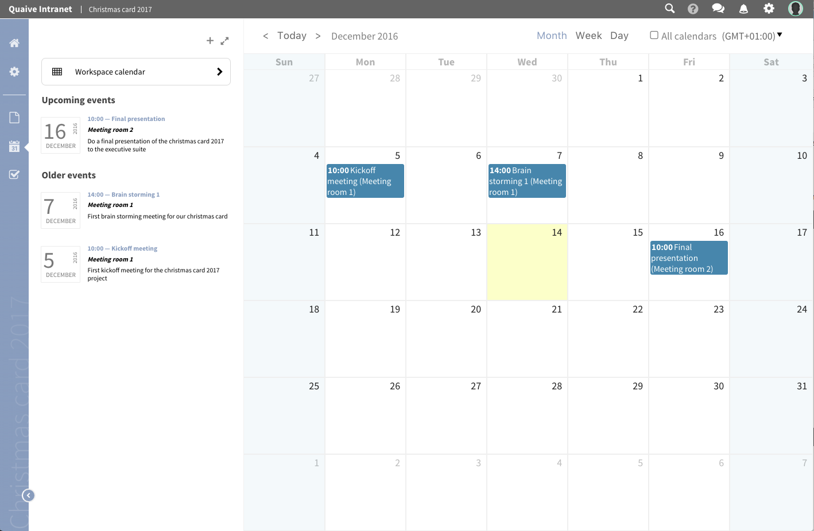
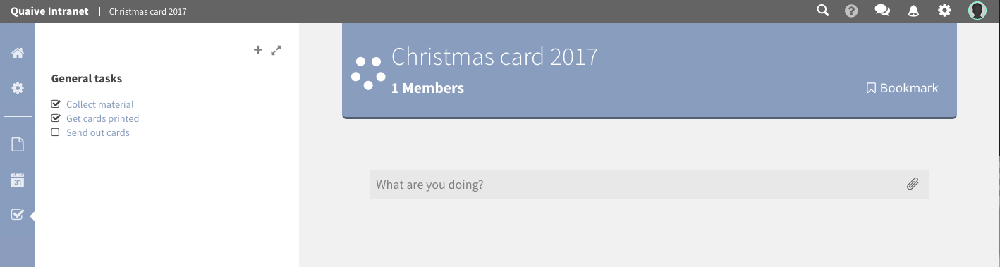

Overview
===================

In this section of the manual you will create your first demo workspace.
Then we will take a closer look at the different sections of this workspace.

-------------------------
Create a workspace
-------------------------

On the workspaces overview page that was shown on the Workspaces page of this manual, you can find a plus icon above the list of existing workspaces.

**Note:** If you cannot see the plus icon the user you are using does not have the necessary permissions to create workspaces within the Quaive portal. Please ask your site administrator to grant you the necessary permissions.

After clicking the plus icon, a form opens for creating the new workspace

Fill in a title and - if wanted - a short description what this workspace is about.
The pulldown below the description textarea is about the security settings of the workspace.
For this first workspace we will use the default value for the security settings and so will create a self-managed, private workspace.

**Note:** You can see the different options when looking at the pulldown values and can get information about the different security policies and their effects on the workspace accessibility when selecting them. For more information on security policies please take a look here: :ref:`workspace-settings-security-label`

Then click "Create workspace" to finally create your first workspace.

.. image::  images/create-workspace-3.png

When entering a workspace you can see a set of icons in the coloured vertical bar on the left of the page. This is the section navigation of the workspace and the icons represent the different sections of the workspace. Clicking them opens the sidebar, a vertical panel for the selected section.

The different sections of a workspace are listed here. Click one of the links to get more information about a specific workspace sections:

* :ref:`workspace-overview-home-label`
* :ref:`workspace-overview-settings-label`
* :ref:`workspace-overview-documents-label`
* :ref:`workspace-overview-events-label`
* :ref:`workspace-overview-tasks-label`

.. _workspace-overview-home-label:

----------------------------------
Home
----------------------------------

The first icon - the house icon - represents the home view of a workspace.
When clicking on it the sidebar is closed and the main view of the workspace with the social stream is displayed.

Learn more about using the social stream here: :ref:`social-stream-label`.

.. image::  images/workspace-home.png

.. _workspace-overview-settings-label:

-------------------
Settings
-------------------

The gearwheel icon opens the settings section. Here all metadata of a workspace is stored and managed.
Also the members of a workspace and the workspace security settings can be edited in this area.

Learn more about managing the workspace settings here: :ref:`workspace-settings-label`

.. _workspace-overview-documents-label:

-------------------
Documents
-------------------

In the documents section all content stored in a workspace is managed.

Learn more about handling workspace content here: :ref:`workspace-content-label`

.. _workspace-overview-events-label:

-------------------
Events
-------------------

In Quaive every workspace has its own calendar where the events of this workspace are displayed and can be managed.
There is also an option to have workspace events displayed in the site wide calendar app to be served to users outside the workspace.

Learn more about the workspace calendar and handling events here: :ref:`workspace-events-label`

.. _workspace-overview-tasks-label:

-------------------
Tasks
-------------------

In this section the tasks of this workspace are managed. New tasks can be created and you also can get an overview over tasks created and assigned to you by other workspace users. You can also see if a task is still open or already closed.

Learn more about tasks and their usage within a workspace here: :ref:`workspace-tasks-label`

