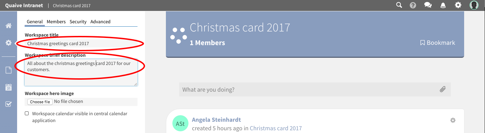
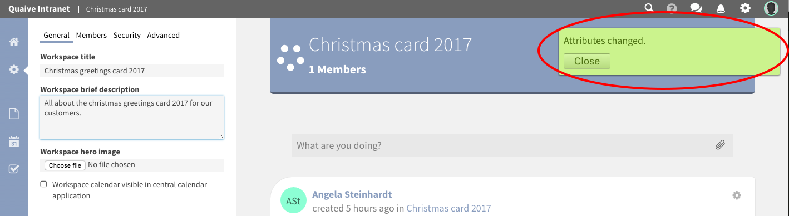
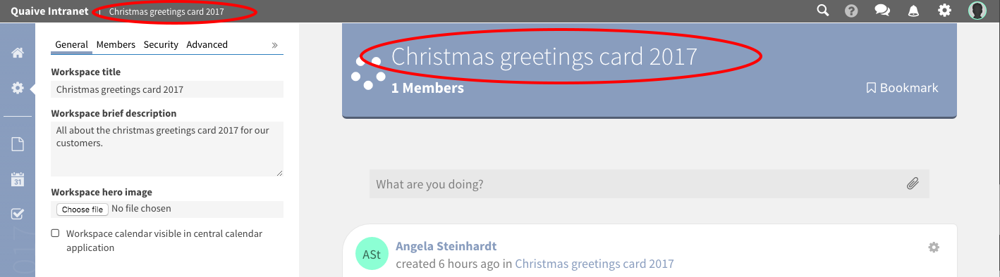
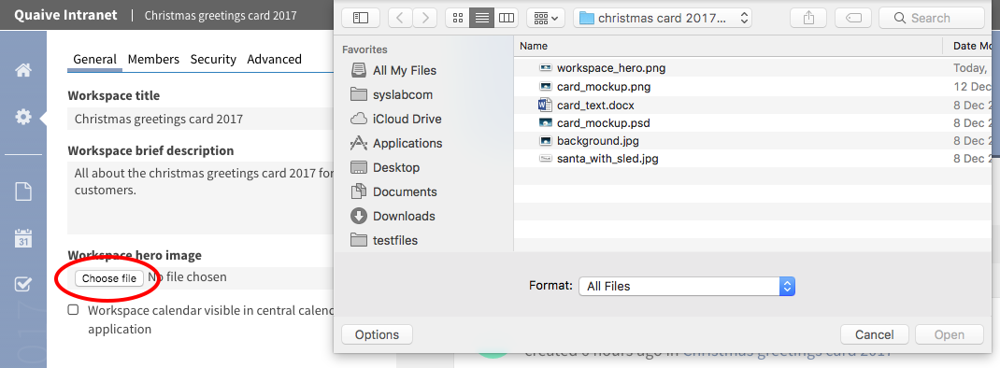
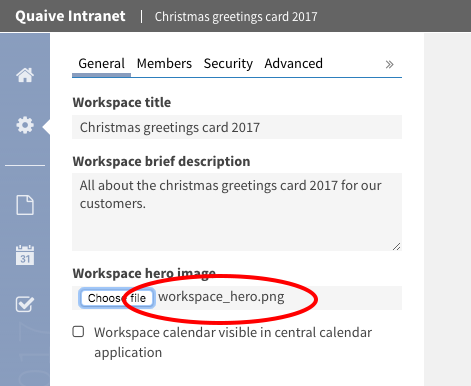
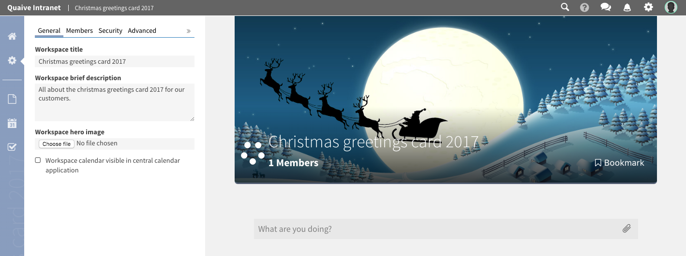
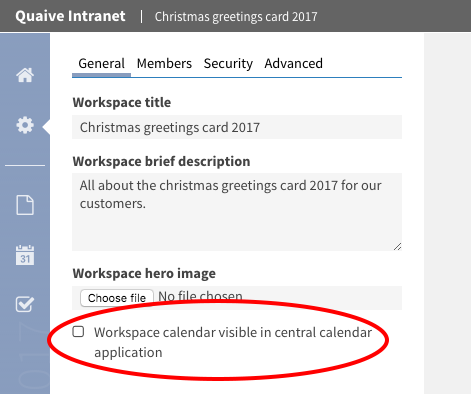

.. _workspace-settings-label:

Settings
==================

This part of the manual is about how to change the different workspace settings.

The gearwheel icon opens the settings section. Here all metadata of a workspace is stored and managed.
Also the members of a workspace and the workspaces security settings can be edited in this area.

.. image::  ../images/workspace-settings-sidebar.png

When in settings section, you can see several tabs at the top of the sidebar.
These tabs open the available subsections of the workspace settings:

.. contents::
    :depth: 1
    :local:

-----------
General
-----------
Here general metadata like title, description and the workspace's hero image can be changed.

.. image::  ../images/workspace-settings-general.png

How to change title and description of a workspace
++++++++++++++++++++++++++++++++++++++++++++++++++++++

To change a workspace's title and description just type a new title or description in the text field or area in the sidebar.

The metadata is immediately autosaved and a info popup tells you that some attributes have been changed.

After the page is reloaded you can see the new workspace title in the breadcrumbs and the workspace header.

How to change the hero image of a workspace
++++++++++++++++++++++++++++++++++++++++++++++++++++++

Each workspace can have a hero image to be displayed as a visual element in the workspace's header section background.
Changing this image can also be done in the general settings section.

To change the image click the "upload" button in the sidebar and select an image in the opening file browser of your computer.

The image will be changed immediately as the metadata again is autosaved.

Reloading the page will display the image in the header section of your workspace.

.. _workspace-settings-central-calendar-label:

How to display the workspace events in the global calendar
+++++++++++++++++++++++++++++++++++++++++++++++++++++++++++

There is a possibility to display the events of your workspace in the global calendar app.
To enable this you have to check the checkbox "Workspace calendar visible in central calendar application"

Learn more about events and the workspace calendar here: :ref:`workspace-events-label`

.. _workspace-settings-members-label:

-----------
Members
-----------
In the Members section you can see which users and groups are members of this workspace and which roles they have on it.
Here you can add new members or groups, delete existing ones or change the specific role of a member or a group.

.. image::  ../images/workspace-settings-members.png

.. ** How to add a member to a workspace
.. ** How to remove a member from a workspace
.. ** How to change the role of a workspace member

.. _workspace-settings-security-label:

-----------
Security
-----------
On the security panel you can see the current security settings of the workspace. This is called the workspace policy.
You can get information about the external visibilty, the join policy and the participant policy of a workspace.
All these settings of a workspace can be changed for existing workspaces whenever needed.
Short explanations offer information about the current and possible options for these settings to make sure what effects on the workspace and it's content a change has.

.. image::  ../images/workspace-settings-security.png

.. ** How to change the security settings of a workspace

-----------
Advanced
-----------
In the avanced settings section extended functionality on a workspace can be found such as setting up related workspaces, division support but also actions like archiving, freezing or deleting the workspace

.. image::  ../images/workspace-settings-advanced.png

.. ** How to use divisions
.. ** How to archive/unarchive a workspace
.. ** How to freeze/unfreeze a workspace
.. ** How to set a related workspace
.. ** How to change the custom order of workspace tags
.. ** How to delete a workspace

