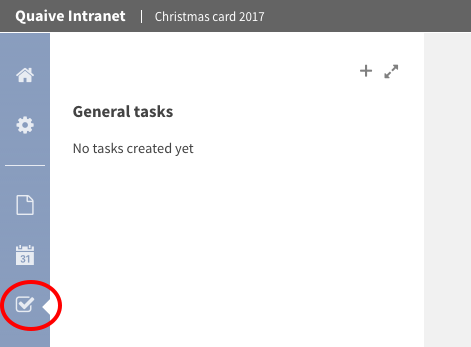
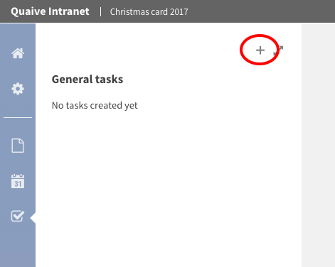
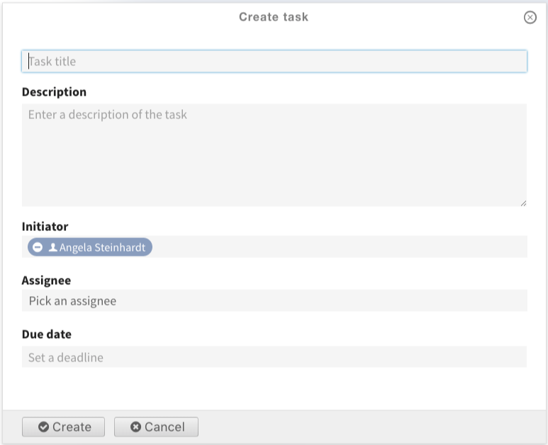
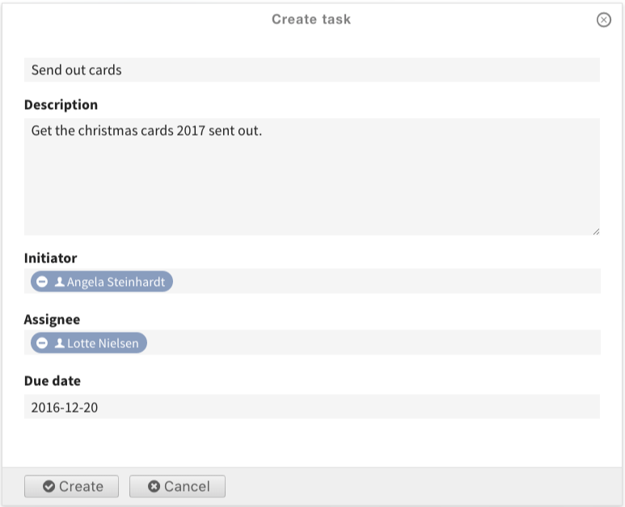
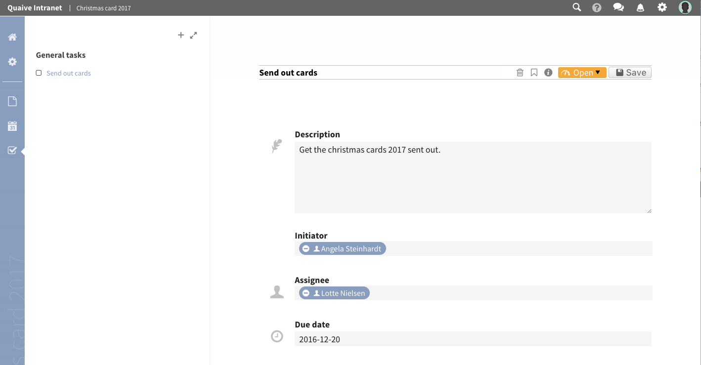
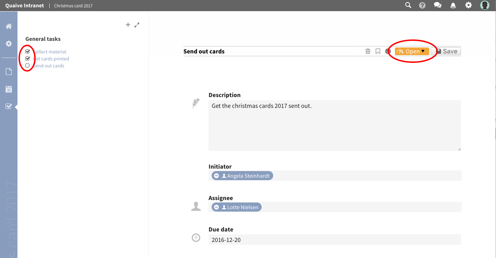
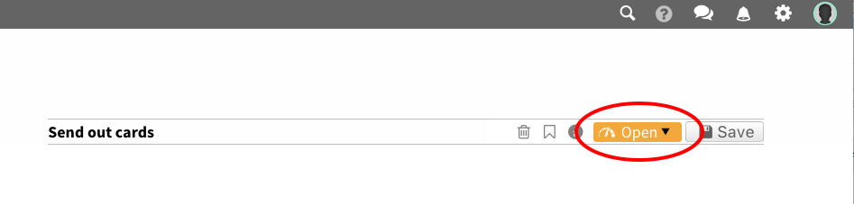
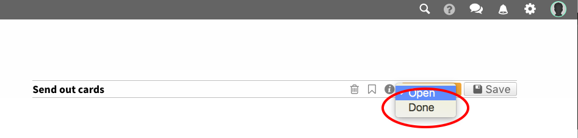
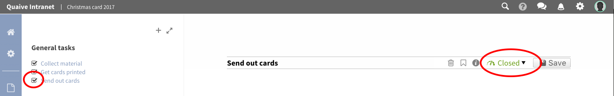

.. _workspace-tasks-label:

Tasks
==================

This part of the manual is about how to use and create tasks in an existing workspace.

In a workspace in Quaive you can use tasks to define small pieces of work and - if you want - assign this to another user.
Tasks can be closed when the job is finished and reopened again if this seems necessary.
A notification email is sent out to the different users when a task was edited or it's status was changed.

To access the task section of your workspace and see existing tasks and their status click the little checkbox icon in the section navigation of your workspace.

Now you will learn how to

.. contents::
    :depth: 1
    :local:

-------------------------------
Create a task in a workspace
-------------------------------

To create a task in a workspace, click the plus icon in the sidebar.

This opens the create task form.

We will take a closer look to the fields on the create task form. From the top they are:

* **Task title** (*required*): The title is displayed in all places where the task is listed - sidebar, portlets, listings, ...
* **Description**: the description can be used to describe the task if necessary
* **Initiator** (user picker field): the user initiating the task (this field is prefilled by the user who created the task)
* **Assignee** (user picker field): the user the task is assigned to
* **Due date** (calendar field): the due date this task should be done

Only the title field is required. All other fields are optional and can also be left blank.

For date fields in Quaive a handy popup-calendar helps you selecting the date easily.

For the user related fields Quaive offers a special user picker that helps you browsing the user database to find portal users and assign them.
More about the user picker field type you can read in the events section here :ref:`quaive-user-picker-field-label`

That's how the form looks for our test task. To create the task just click the button "Create" at the bottom of the form.

Your task is now created and listed in the sidebar under "General tasks".

There will be a section older events which holds events of this workspace with end dates in the past. You can see that in the next chapter of this manual when we take a closer look at the workspace's :ref:`calendar-view-label`.

-------------------------------
Change the status of a task
-------------------------------

When you create a task in a workspace, the status of this task is open. This means, the work still has to be done, the job awaits doing.

Usually you assign a task to a specific user and then this user has the task in his task list on the dashboard to see action needs to be done.
After this user - or also someone else - did the job, he may want to inform you about it and this can be done by closing the task.
So a closed task tells you the work has been done.

Of course tasks can be reopened again if needed so the actions described now can also be performed to re-open a closed task.
You can see the current status of all tasks in the sidebar by looking at the task's checkbox. Checked means the task is done, unchecked means it's still open.

To close our newly created task we click on the task title in the sidebar to open the task's edit view.
In the edit actions bar you can see the current status of the task. For our task, the status is "Open" - you can also see this in the sidebar.

To change the status of the task open the status pulldown and select "Done".

A spinner shows that the status of the task is changed immediately and also the sidebar is updated automatically - the checkbox in front of the task is checked now.
You can also use the sidebar checkboxes to close or re-open a task by simply checking or unchecking it's checkbox.

